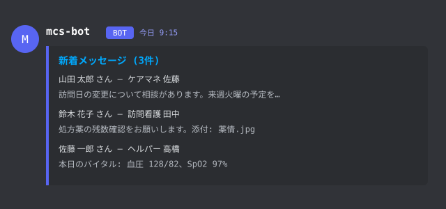

# hermes-mcs — MedicalCareStation 未読モニター + レビュー支援

医療・介護の現場向けメッセージ基盤 **MedicalCareStation (MCS)** の記録を
15分間隔で収集・保存し、Discord 通知・検索・統計・レビュー候補提示までを
一気通貫で行うローカルシステム。Hermes エージェントの addon としても動作する。

> 記録の収集・提示と人による確認・判断の境界を設計上の安全ゲートとして
> 分離している。「記録が見つからない」ことを「対応がなかった」証拠として
> 扱わない — 候補は常に原記録の確認を求める提示。

## 解決する課題

医療従事者・ケアマネ・訪問看護の現場で起きる問題:

- **未読の取りこぼし** — MCS の未読メッセージを巡回する負荷を自動化。
  15分ごとに収集し Discord #mcs に通知するので、見逃しを減らす
- **過去記録の埋没** — 患者ごとの全履歴を SQLite + FTS5 で蓄積。
  「あの薬の言及はいつだっけ」を全文検索・タイムラインで即座に辿れる
- **フォロー漏れの発見** — 「薬が変わったが後続記録がない」
  「退院/転院の記録の前後で薬変更の言及がある」など、
  人が目視では拾いきれないレビュー候補を機械的に列挙する
- **判断負荷の局所化** — LLM による構造化抽出(薬剤名・依頼・否定極性)は
  「候補」として提示するだけ。確定・登録は必ず人の明示承認を経る

## 機能一覧

| 機能 | 内容 |
|---|---|
| 未読収集 + Discord 通知 | API-first で15分間隔収集、構造化→原文の2段投稿、添付同梱 |
| 全履歴アーカイブ | 過去分の一括/増分取込、ページカーソルで中断再開、アーカイブ患者も追跡 |
| 全文検索・タイムライン | FTS5 + 日本語空白無視の部分一致、患者タイムライン、スレッド時系列 |
| 構造化抽出 | ルールベース `extract_v1` + ローカルLLM `extract_llm`(薬・依頼・否定極性) |
| 患者ロールアップ | 最新バイタル・現在の薬期間・未解決依頼・次回予定を患者単位で再構築 |
| 統計(読み取り専用) | snapshot 上の集計。原本を一切変更しない。「対象なし」と「情報不足」を区別 |
| レビュー候補シグナル | 薬変更後の記録なし・依頼滞留・退院/転院±薬変更・連絡集中・期間終了間近 |
| 人承認の依頼管理 | 候補→人が確認→`--confirm-human` で台帳登録。MCS へは送信しない |
| Hermes addon | `/mcs <json>` コマンドを Discord から実行(閲覧・依頼 preview/confirm) |

## 仕組み

```
MCS (MedicalCareStation)
   │  API-first / CDP(Chrome :9333) セッション自動再ログイン
   ▼
run_check.py ──15分 tick──► ledger.db (SQLite/WAL)
   │                          ├ messages + messages_fts(FTS5)
   │                          ├ artifacts(extract_v1 / extract_llm / signals)
   │                          └ requests / command_receipts(人承認操作)
   ▼
notifier.py ──► Discord #mcs      mcs_view.py ──► 検索/統計/シグナル閲覧
   │                                    ▲
   └ snapshots/ (read-only 公開) ────────┘  cco コンテナ・hermes plugin は
                                            snapshot だけを読む
```

- 収集は launchd 3層(定期 tick・深掘り trickle・cmd WatchPaths 即時)
- LLM はローカルのみ(llama.cpp `127.0.0.1:8080`)。患者記録は外部へ出ない
- 通知は `signals.notify:true` の明示設定時のみ既存 outbox 経路で送信

### ローカルLLM・外部API の使用箇所

| 用途 | 使用先 | モジュール |
|---|---|---|
| メッセージ構造化抽出(薬・依頼・否定極性・要約) | ローカルLLM llama.cpp `127.0.0.1:8080` slot1 | `mcs/extract_llm.py` |
| セマンティック処理のリアルタイム問合せ | ローカルLLM slot0 (`id_slot:0`) | `mcs/semantic.py` `llm_chat` |
| 意味的妥当性の評価・監査・ベンチ(Jev) | TypeSafe Jev API `api.typesafe.ai` | `mcs/semantic_jev.py`・`semantic_assessment.py`・`semantic_audit.py`・`semantic_bench.py` |

- **ローカルLLM**: 患者記録の構造化はすべて loopback 固定・proxy 無効の
  ローカルサーバで処理 — 個人情報はマシンから出ない
- **Jev**: `semantic.mode` を `shadow|enforce` にした場合のみ使用。
  `TYPESAFE_API_KEY` が必須(`mcs_setup.py check` が検証)。記録本文ではなく
  評価用の state/questions を送る設計 — 本文は DATA として扱い
  プロンプトインジェクション境界を設けている
- `semantic.mode:off` なら Jev は一切呼ばれず、ルール抽出のみで動く

## 画面イメージ

**Discord 通知 — 上に構造化・下に原文の2段構成**



`📋 構造化` ブロックはローカルLLMの抽出(要約・要点・区分・バイタル・
症状・依頼)をコンパクトに提示し、その下に原文をそのまま載せる。
抽出が無い/失敗時は原文のみにフォールバック。

**取込状況・タイムライン (`mcs_view.py status` / `timeline`)**


**レビュー候補シグナル (`mcs_view.py signals`)**


## 導入方法

### Hermes addon として(clone して使う)

```bash
git clone https://github.com/yusuketakuma/hermes-mcs.git
cd hermes-mcs && ./install.sh      # ~/.hermes/plugins/mcs-discord-commands をリンク
```

profile の `config.yaml` で有効化(全 scope 必須、未設定は拒否):

```yaml
plugins:
  enabled: [mcs-discord-commands]
  entries:
    mcs-discord-commands:
      settings:
        snapshot: /path/to/mcs/snapshots/ledger-snapshot.db
        inbox: /path/to/mcs/cmd
        allowed_user_ids: ["<discord user id>"]
        allowed_chat_ids: ["<discord chat/channel id>"]
        project_ids: [1]
```

Discord で `/mcs <json>` が使えるようになる。詳細: `hermes_plugin/README.md`

### 収集パイプラインのマシンセットアップ(Mac mini 等)

```bash
python3 mcs/mcs_setup.py init    # 対話式: config + Keychain + .env
python3 mcs/mcs_setup.py check   # 必須条件の検証(exit 1 で失敗)
```

`init` が行うこと: `~/.mcs/config.json` 生成・Keychain `mcs-adapter` への
MCS パスワード登録・`~/.mcs/.env` に `DISCORD_BOT_TOKEN`/`TYPESAFE_API_KEY`
保存・`--semantic-mode` で Jev 連携有効化。`check` は必須キーの型・
Keychain・Chrome・トークン解決・ローカルLLM 到達性を typesafe に検証する。

## 使い方

```bash
PY=~/.hermes/hermes-agent/venv/bin/python
$PY mcs/mcs_view.py status                    # 取込状況
$PY mcs/mcs_view.py search --project 123 --query '確認'
$PY mcs/mcs_view.py timeline --project 123 --limit 50
$PY mcs/mcs_view.py stats --preset operational
$PY mcs/mcs_view.py signals                   # open なレビュー候補
```

人承認の依頼登録・却下・閾値ポリシーなどの詳細は下記「閲覧・依頼管理」。

## 安全設計

- **人承認境界** — 依頼登録・シグナル却下・閾値変更はすべて
  `--confirm-human` + `reason` + receipt 記録付きの ops 経路のみ。
  自動確定・自動通知はしない
- **「不在≠未実施」** — 候補は「記録が見つからない」事実の提示であり、
  対応の欠如を意味しない。文言にも明記
- **既読化ゲート** — fetch_state=complete かつ ledger commit 済みの患者のみ、
  snapshot timestamp を必ず送信
- **no-redirect / no-proxy** — Bearer は許可 origin 以外へ送らない。
  レスポンス本文はログに出さない
- **定期実行は本文・氏名を出さない** — 明示的な `mcs_view` 閲覧のみ例外

## ライセンス

Private repository — 現時点で公開・再配布は想定していない。
利用・改変はリポジトリ管理者の明示許可に従う。

---

## 構成

- `mcs/mcs_adapter.py` — API client / CDP token bootstrap / auto_login
                              (keep_read_status=1 全経路、login origin 固定、
                              redirect/proxy 拒否、mark_as_read 応答厳密検証)
- `mcs/ledger.py`       — SQLite (runs, patients + coverage_ts/
                              history_target, messages, messages_fts(FTS5),
                              attachments + retry state, notify_outbox +
                              progress, read_marks, artifacts, fetch_jobs)
                              + `LedgerReader`(ro) + `publish_snapshot()`
- `mcs/mcs_view.py`     — 取込状況・根拠付き検索/タイムライン・依頼管理CLI
- `mcs/mcs_requests.py` — 人手確定依頼・入力検証・原子的キュー投入・操作receipt
- `mcs/run_check.py`    — launchd エントリポイント (orchestrator のみ:
                              args/flock/deadline/段階別 status/例外境界)
- `mcs/job_ops.py`      — cmd ingest・fetch_jobs drain・discovery・
                              trickle 深掘り seed・thread merge
- `mcs/maintenance.py`  — 日次検証済み backup・log rotation・snapshot 公開
- `mcs/init_data.py`    — 過去分一括/増分取込 (history_floor +
                              history_target/page カーソル、floor は返信
                              完了後のみ確定、通知・既読化なし)
- `mcs/notifier.py`     — Discord outbox drain (2段構成:構造化→原文、
                              chunk receipt+送信表現fingerprint、429対応、宛先固定、
                              DL済み添付を multipart で同梱 ≤10件/24MiB。
                              未送信イベント参照の添付はDLキューで優先化され、
                              添付投稿の確定的拒否時は本文のみにフォールバック)
- `chrome-profile/`         — 専用 Chrome user-data-dir (CDP :9333)
- `data/ledger.db`          — 取得済みレコード (WAL)
- `data/snapshots/`         — read-only スナップショット (CCO/コンテナ向け、
                              DELETE journal化→schema/quick_check→atomic rename)
- `data/backups/`           — 日次検証済み sqlite backup (7世代)
- `data/cmd/*.json`         — bot コマンドキュー (WatchPaths で即時実行)
- `token_cache.json`        — bearer cache (0600; data/ 外=サンドボックス非公開)
- `config.json`             — {discord_channel_id, mcs_login_id,
                              notify_bot_profile?, discover_archived?} —
                              notify_bot_profile 設定時は通知投稿を
                              ~/.hermes/profiles/<name>/.env のボット名義に固定
                              (既定は ~/.hermes/.env = ジャービス)。
                              discover_archived は保管/削除でアーカイブ
                              された患者の「新規列挙と取り込み予約」だけを
                              止めるスイッチ — 既にpendingの取り込みジョブは
                              false でも消化され続ける(完全停止ではない)

## 運用

- スケジューラ: `~/Library/LaunchAgents/local.mcs-check.plist`
  (00/15/30/45分, RunAtLoad) — ログ `data/run.log`
- 深掘り trickle: `local.mcs-deep.plist` (07/37分, `--jobs-only`) —
  未読取得を飛ばし fetch_jobs のみ消化。全患者の全履歴を
  `since=0` まで少しずつ取得(1run=最大8患者×3頁、cursor は payload に
  耐久保存、中断しても次 run で続きから)。config `deep_history` で
  有効/無効、`trickle_pages` で頁数変更
- discovery: `fetch_jobs(kind='discovery')` が1日1回 `/projects` を
  列挙 → 未読を出さない新規患者を自動登録し trickle seed。
  `discover_archived` が有効なら `/kartes?is_archived=1` も列挙し、
  `is_archived=1` で登録＋`history_head` job(最終同期予約)を同一Txで
  起こす。アーカイブ患者はfrontier/backfill対象外・通知抑止。
  既にアーカイブ済みで消化中ジョブも確定floorも無い患者には
  補修用 `history_head` を再予約する (失われた予約の修復)
- cmd 即時実行: `local.mcs-cmd.plist` (WatchPaths `data/cmd/`) —
  bot が JSON を書くと次回 tick を待たず run_check が起動
  (flock 衝突時は定期 run が拾う)
- コマンド形式: `{"cmd":"import","project_id":N,"days":N,"pages":N}`
  (days≤365, pages≤40, GET-only — 既読化系は実装していない)
- 手動実行:
  `~/.hermes/hermes-agent/venv/bin/python mcs/run_check.py --json`
- フラグ: `--mark-read`(手動のみ。snapshot timestamp 必須で型強制)
  `--download-files` `--no-backfill` `--no-notify`
- exit codes: 0 ok / 1 failed / 2 session_expired(手動要) / 3 lock_held

## 履歴取込 (init_data.py)

```bash
PY=~/.hermes/hermes-agent/venv/bin/python
$PY mcs/init_data.py --days 45            # 直近45日に活動のあった患者を深掘り
$PY mcs/init_data.py --days 45 --pages 10 # ページ上限 (1頁=数十msg)
$PY mcs/init_data.py --project <id>       # 患者個別
```

- `patients.history_page` = 消費済みページカーソル — 中断/上限到達時は
  そこから再開。`history_floor` = 確定済みの最深日時 (floor≦since の患者は skip)
- 再開時はページ移動を吸収するため直前1頁を再取得し、message_id PK で重複排除
- 返信スレッド全文・添付メタも保存 (添付 DL は次回の定期 run)
- 通知 outbox には入れない — 過去分で #mcs をスパムしない

## 保存データの再利用

- `messages_fts`: `ledger.search("クエリ")` — body_text+sender_name の FTS5
- `ledger.patient_timeline(pid, limit=100, before=(ts, id))` — 患者タイムライン
- `ledger.thread(parent_id)` — スレッド時系列
- `artifacts` テーブル: `artifact_add(kind, ...)` / `artifacts(kind, ...)` —
  LLM 要約・トリアージ・タグ・エクスポート等の派生データ格納用
- `posted_at_ts` (epoch) で範囲クエリがインデックス済み
- `extract.py` — ルールベース構造化 (kind='extract_v1'): events/visit_date/
  next_planned/med_periods/medications/rx_actions/vitals/symptoms/
  adherence_flags/requests/actors/soap/urgency をJSON化。run_check が毎回
  差分抽出 (`run_pending`)。再抽出は全件削除→`--all` 再実行で冪等
- `extract_llm.py` — ローカルLLM (Qwen3.5-9B @ llama.cpp :8080) による
  高度抽出 (kind='extract_llm'): 用量なし薬剤名・否定極性・依頼宛先・
  30字要約・要点points。schema検証済み出力のみ保存、失敗は
  meta.error+backoff で retry (上限5)。loopback固定・proxy無効。
  run_check が残予算で差分処理、全量は `--all` で drain (中断安全)。
  llama-server は `-np 2`: slot0=realtime (semantic.llm_chat)、
  slot1=background (extract_llm) に `id_slot` で pin。`--all` は
  per-write lock のみで run.lock を長期保持しない (tick を阻害しない)
- `rollup.py` — 患者ロールアップ (kind='patient_rollup'): 最新バイタル・
  現在の薬期間・薬剤一覧・直近症状(否定統合済み)・未解決依頼・次回予定・
  possibly_deleted を患者毎に原子的再構築。`dirty_projects()` で
  元データ/artifact 更新のあった患者のみ更新
- `find_patients(name)` / `fuzzy_search(term)` — 空白無視の部分一致
  (日本語向け。FTS5 は CJK トークン化が弱いため併用)

## 閲覧・依頼管理

既定は `data/snapshots/ledger-snapshot.db` の読み取り専用接続。
`--snapshot PATH --cmd-dir DIR` でコンテナのマウント先を指定できる。
原本DBは不要で、未公開DB・旧スキーマでは利用を拒否する。
導入後、通常の定期実行がschema v5へ移行し新snapshotを公開すると利用可能になる。

```bash
PY=~/.hermes/hermes-agent/venv/bin/python
$PY mcs/mcs_view.py status
$PY mcs/mcs_view.py status --project 123
$PY mcs/mcs_view.py search --project 123 --query '確認'
$PY mcs/mcs_view.py timeline --project 123 --limit 50
$PY mcs/mcs_view.py evidence --project 123 --message-id 456
$PY mcs/mcs_view.py thread --project 123 --message-id 456
$PY mcs/mcs_view.py attachments --project 123 --message-id 456
$PY mcs/mcs_view.py candidates --project 123
$PY mcs/mcs_view.py requests list --project 123 --status open
$PY mcs/mcs_view.py requests show --project 123 --request-id 1
```

これらは明示的な閲覧コマンドなので、JSON出力に患者の本文・投稿者・依頼内容を含む。
共有ログ・外部LLM・公開リポジトリへ転送しない。定期実行ログは引き続きID・件数・状態だけ。

- `status` は氏名や本文なし。`last_successful_unread_fetch` は未読取得の成功日時で、
  履歴全体の取得成功日時ではない。本文・返信・添付の未完了数、履歴の目標/ページ、
  保存済みエラー理由を分けて表示する。過去ジョブの理由が保存されていなければ `not_recorded`。
- `history_record` は完了記録なし／cutoff到達記録／API自然終端到達記録を区別する。
  pinned順・返信ページング等は未検証のため、いずれも `gapless_verified:false`。
  `exact_missing_ranges:null` は欠落範囲を確定できない意味。本文未完了の最古〜最新は
  未完了レコードの分布であり、その期間全体に欠落しているという意味ではない。
- 本文はplain text。出典は保存済み患者ページURL＋投稿IDで示し、存在未確認の投稿URLを作らない。
  `first_seen/updated_seen` は保存データの観測日時で、編集履歴や全取得履歴ではない。
  添付は保存状態・取得日時・サイズ・hashを表示し、署名URLやホストパスは出力しない。
- `timeline` は親投稿のみ。返信は `thread`、添付詳細は `attachments` で別途取得する。
  `search` は本文・投稿者の日本語部分一致、空白区切りAND、`%`/`_`も文字として検索する。
- 一覧は既定50／最大200件。`next_cursor` を同じ条件の `--cursor` に渡す。
  世代・患者・検索条件が変わったcursorは拒否するので、snapshot更新時は先頭から再取得する。
  投稿一覧の `--since/--until` は包含のepoch秒。日時不明投稿は期間指定時には含まれない。
- `candidates` はメッセージ単位のページで、候補なしの投稿も含む。最新・成功・現行本文hash一致・
  全文取得済みの抽出だけを表示する。LLM停止中も既存ルール抽出は使える。候補は未確定の提案であり、
  既存rollupの依頼「言及」と同じく、未処理の臨床業務だと断定しない。

### 統計（読み取り専用）

```bash
$PY mcs/mcs_view.py stats --list                     # 登録済み統計の一覧
$PY mcs/mcs_view.py stats --stat overview            # 単一統計
$PY mcs/mcs_view.py stats --preset operational       # プリセット束
$PY mcs/mcs_view.py stats --stat patient_activity \
    --since 2026-09-01 --until 2026-10-01 --project 123 --limit 20
```

- snapshot上の読み取り専用集計。原本・依頼状態・通知を一切変更しない。
- `--since/--until` は半開区間 `[since, until)`。日付のみはJST当日0時。
  1日分を取るには翌日を `until` に渡す。`until <= since` は拒否。
- `--as-of` はsnapshot生成時刻が既定で、それより未来は拒否。
- 分母0は `null`（0%とは別）。`ok/partial/unavailable` で利用可否を明示し、
  「対象なし」と「情報不足で判定不能」を区別する。
- 薬の集計は抽出言及レベル。成分正規化・否定/家族/過去言及の分離は未実装で、
  その旨をnotesに明記する。部屋数は確定患者数ではない。
- `rx_expiry` は extract_v1 の期間表現（例 '9/1-9/21'）の終了間近を数える。
  表現のparseであり処方期間の確定ではない。
- `med_change_followup` は「変更言及後7日以内の後続記録（部屋の任意投稿または
  対象メッセージに紐づく依頼登録）を確認できない件数」。記録上の確認であり
  対応の欠如の証明ではない。`transition_reconciliation` は extract_llm の
  型付き discharge/transfer イベント±14日の薬変更言及の共起カウント —
  照合要否は人の判断。検出は抽出済み記録の範囲に限る。

### レビュー候補シグナル（T2）

```bash
$PY mcs/mcs_view.py signals                # openな候補一覧
$PY mcs/mcs_view.py signals --project 123
```

- `run_check` の derive 段階で `mcs_signals.evaluate()` が候補を再計算し、
  `signal_v1` artifact として台帳に保持する（open→resolvedのライフサイクル、
  検知日・最終確認・証跡ID付き）。
- 検知器: `request_overdue`（依頼登録の期限超過）、`request_aging`
  （登録から30日超の未完了依頼）、`med_change_no_followup`（部屋×薬の
  エピソード単位。同一薬の最新言及が7日窓を過ぎても後続記録・依頼登録を
  確認できない場合のみ — 後で応答のあった言及はその薬を追跡中とみなし
  抑制）、`comm_concentration`（直近72hの記録集中）、`rx_period_expiry`
  （期間表現の終了間近）、`transition_reconciliation`（extract_llm の
  型付き discharge/transfer イベント±14日の薬変更言及の共起 —
  「退院」文字列ではなく抽出イベントを使う）。
- 候補は「原記録の確認を求める提示」であり、記録が見つからないことは
  対応の欠如を意味しない。文言もその旨を明記する。
- 人による却下: `mcs_view.py control signal_dismiss --confirm-human` に
  `{"project_id":…, "signal_key":"…", "reason":"…"}` を渡すと、理由・
  実行者付きの dismissed 遷移行を追加する。同じ証跡の間は再検出を
  抑制し、証跡が変われば新しい状況として再openする。
- 閾値の人承認変更: `mcs_view.py control signal_policy --confirm-human` に
  `{"project_id":…, "policy":{"req_age_days":14,…}, "reason":"…"}` を渡すと
  `signal_policy_v1` artifact として記録され、最新が有効値となる
  （キーごとに上限/下限あり。未承認なら既定値）。統計の閲覧が検知条件に
  影響する経路はなく、閾値は人確認コマンド経由でのみ変わる。
- 同一シグナルキーの再通知は最終送信から7日（既定値、policyで変更可）の
  クールダウンで抑制する — open/resolved を往復するシグナルが通知を
  連発しない。
- 通知は config の `signals.notify:true` を明示設定した場合のみ既存の
  notify_outbox 経路（kind='signal'、本文はenqueue時に固定）で送る。
  既定は通知なし。送信直前にフラグとシグナルの現状態を再検査し、
  無効化・解決・却下済みの intent は送らない。

### 人が確認して依頼を登録・更新

**エージェントは内容・根拠・担当者・期限を提示し、人の明示承認を得てから実行する。**
機能の実装依頼や候補抽出だけを、個々の臨床依頼の登録承認と解釈しない。
`actor` と `--confirm-human` は信頼されたローカル境界での申告で、本人認証の仕組みではない。
依頼登録・変更はMCSへ送信せず、ローカル台帳だけを変更する。通知・自動完了は行わない。

承認内容をローカルの `approved-request.json` に用意する（hashは `evidence` の実値に置換）。
必須の `command_id` はUUID。投入前に決め、応答を受け取れなかった場合も
再送時には同じID・同じ内容を保持する（エラー時も既に公開された可能性はある）。
新規操作は `reason`（空白のみ不可、最大2000文字）も必須。理由は操作者・時刻・対象版とともにreceiptへ保存する。
更新前から残っている旧形式のキューは処理できるが、欠けていた理由を補作しない。

```json
{"command_id":"00000000-0000-4000-8000-000000000001","actor":"確認者",
 "source_message_id":456,"source_hash":"取得した64桁content_hash",
 "title":"人が確認した依頼内容","assignee":"担当者","due_date":"2026-09-30","reason":"原文を確認し対応が必要と判断"}
```

```bash
$PY mcs/mcs_view.py requests create --project 123 --confirm-human < approved-request.json
```

更新用JSONは `request_id`、表示された `expected_revision`、人が確認した最新本文の
`expected_source_hash`、`actor`、`reason`、`patch` を指定する。

```json
{"command_id":"00000000-0000-4000-8000-000000000002","actor":"確認者","request_id":1,"expected_revision":1,
 "expected_source_hash":"最新の64桁content_hash",
 "patch":{"status":"done","assignee":null},"reason":"実施結果を確認"}
```

```bash
$PY mcs/mcs_view.py requests update --project 123 --confirm-human < approved-update.json
$PY mcs/mcs_view.py receipt --project 123 --command-id UUID --payload-hash HASH
```

- 状態は `open / in_progress / done / cancelled`。人の承認による再開も可能。
  `patch` はtitle/assignee/due_date/statusのみ。省略は維持、担当者・期限のnullは解除。
  期限は実在する `YYYY-MM-DD`。担当者・期限を抽出結果から自動確定しない。
- 投入応答 `queued` は完了ではない。返されたcommand_id/payload_hashでreceiptを確認する。
  `applied`＝保存済み、`rejected`＝拒否理由あり、`not_processed_or_not_in_snapshot`＝未処理または未公開。
  投入中の `unknown / queue_durability_unknown` は公開後の保存確認失敗（終了コード1）。
  返されたID/hashで結果を照会し、同一ID・同一内容だけで再送する。
  ネットワーク障害や取込中は処理・snapshot公開が遅れる。ファイル消失だけで成功判定しない。
- 同じID・内容は同じ結果を返し、異内容の再利用は拒否。更新はrevisionと現行source hashの一致が必須。
  taskの確定時source_hashは不変。元投稿の編集後は `stale`、消失後は `source_missing` と表示し、
  人手項目は残す。編集後の更新は最新hashの確認が必要、消失後の更新は拒否。
  hashだけでは編集前の原文は復元できない。
- requestsとcommand_receiptsは同時commit。受付記録はactor・変更前後・結果を保存する。
  snapshotの `generation_id/generated_at` は公開世代と生成日時で、データ取得成功の証明ではない。

## 認証

- Bearer token = `localStorage['ngStorage-lastSessionToken']` (JSON parse 必須)
- 失効時: `auto_login()` が Keychain `security find-generic-password -s mcs-adapter`
  のパスワードを login フォームへ input event で注入 → submit click
  (Chrome ネイティブ autofill は DOM 駆動不可のため Keychain 方式)
- loginId はアプリが `storingLoginId` で永続化。空の場合は config の
  `mcs_login_id` で補完
- Keychain 登録: `security add-generic-password -U -s mcs-adapter -a mcs -w`

## 安全ゲート

- 既読化は fetch_state=complete かつ ledger commit 済みの患者のみ、
  snapshot timestamp (list_unread 応答値) を必ず送信 — 省略すると全既読になる
- API はリダイレクト拒否・proxy 無効。DL は許可済みorigin/CDNのみで、Bearerはorigin以外へ送らない
- エラーは構造化 (kind/status) — レスポンス本文はログに出さない
- 定期実行は患者本文・氏名を stdout/log に出さない。明示的な `mcs_view` の閲覧出力は例外。
- outbox は pending/failed/accepted + 指数 backoff — 通知失敗で喪失しない
- 途中送信の本文・添付・宛先が変わった場合は自動再開せず保留し、重複送信を防ぐ

## 検証

```bash
python -m pytest                      # tests/ 全件 (一時DB+スタブのみ)
uv run --with ruff ruff check mcs/ tests/
```

テストは一時DBと通信スタブだけを使い、実MCS・Discord・Keychain・原本DBへ
アクセスしない。`integration/` は hermes-agent checkout 上でのみ収集される。

## 未検証残件

- Bearer の絶対寿命 (auto_login があるため非ブロッカー)
- timestamp 境界の厳密な意味論 (同時刻投稿の包含)
- MFA 画面が出た場合は manual_required → Discord アラートで人へ戻す
