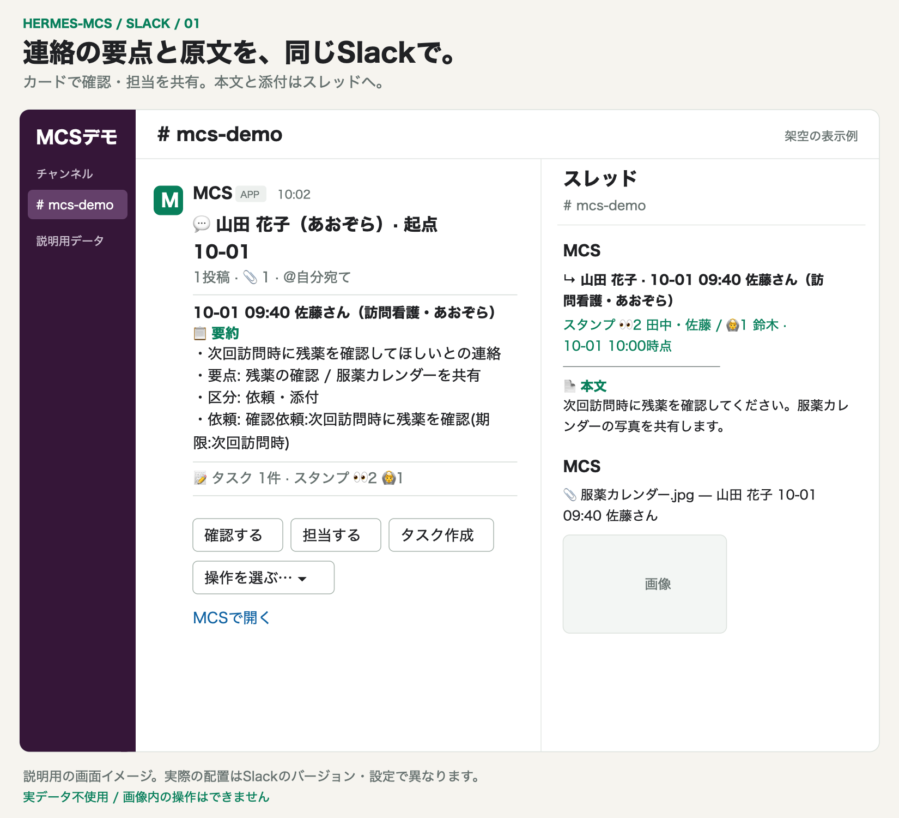
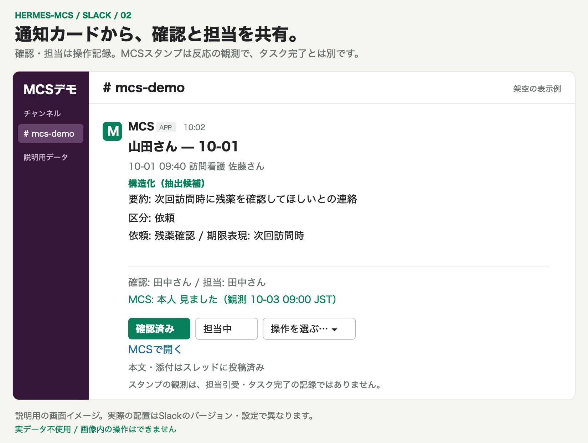
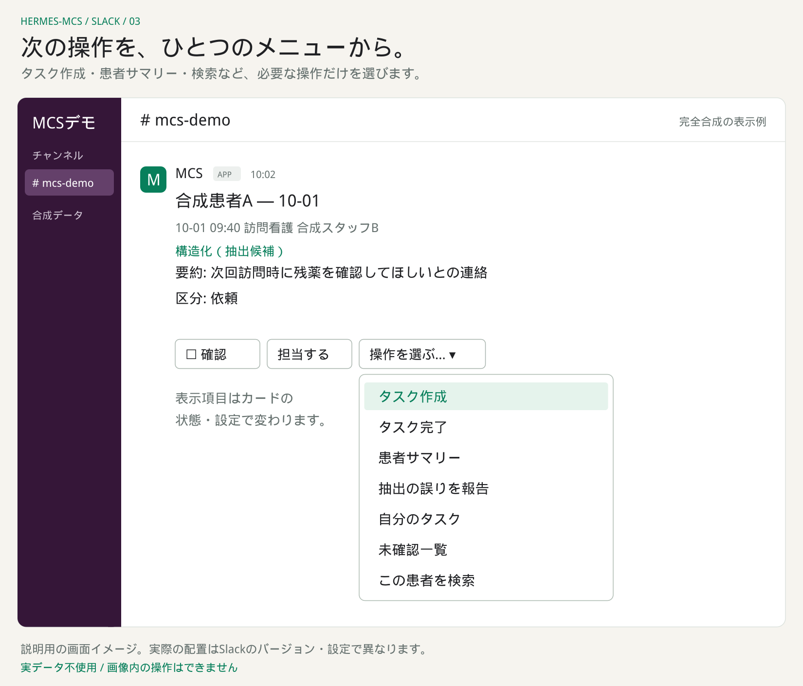
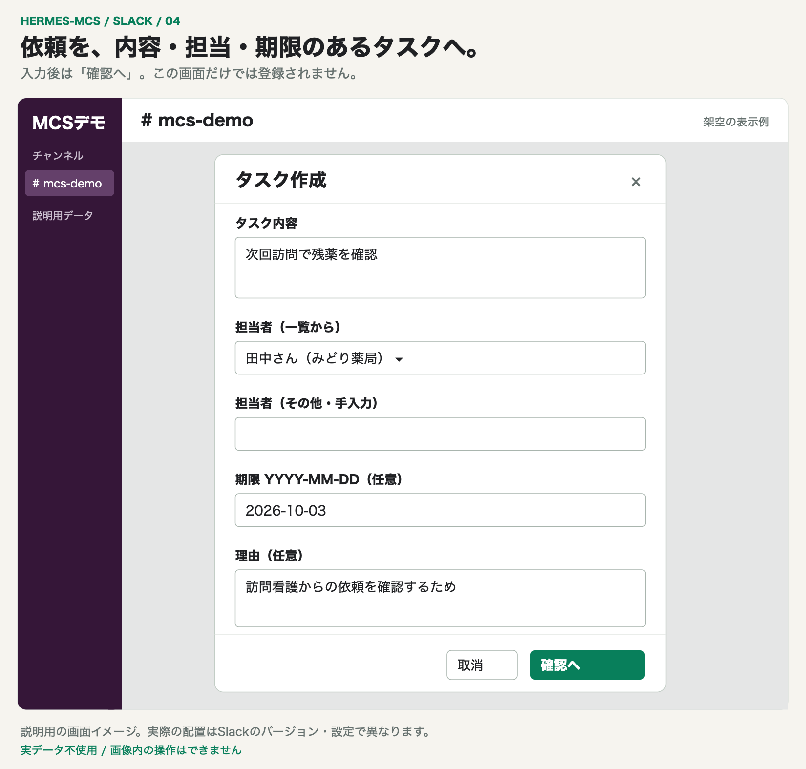
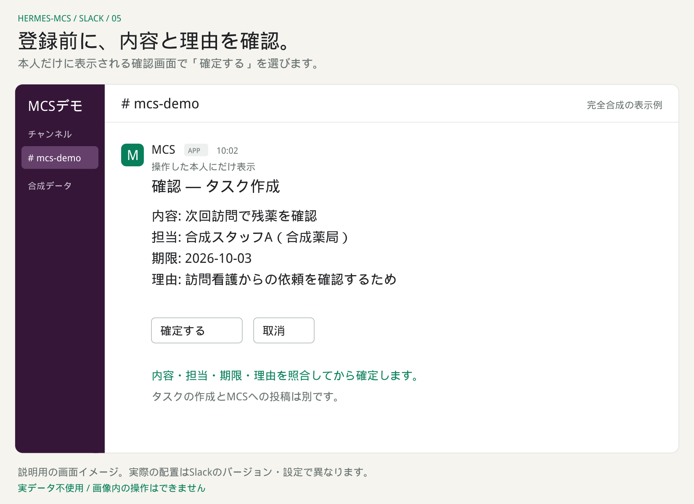
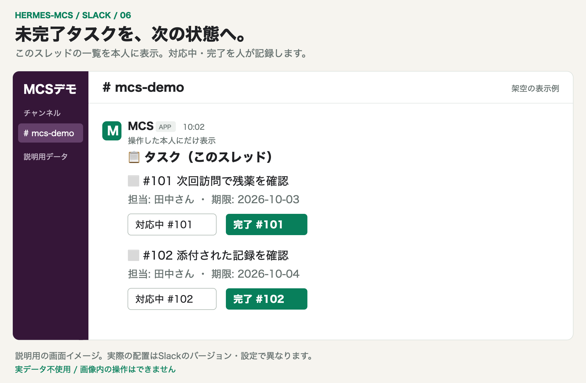
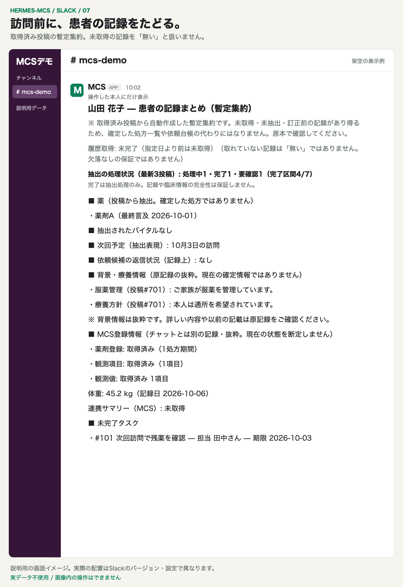
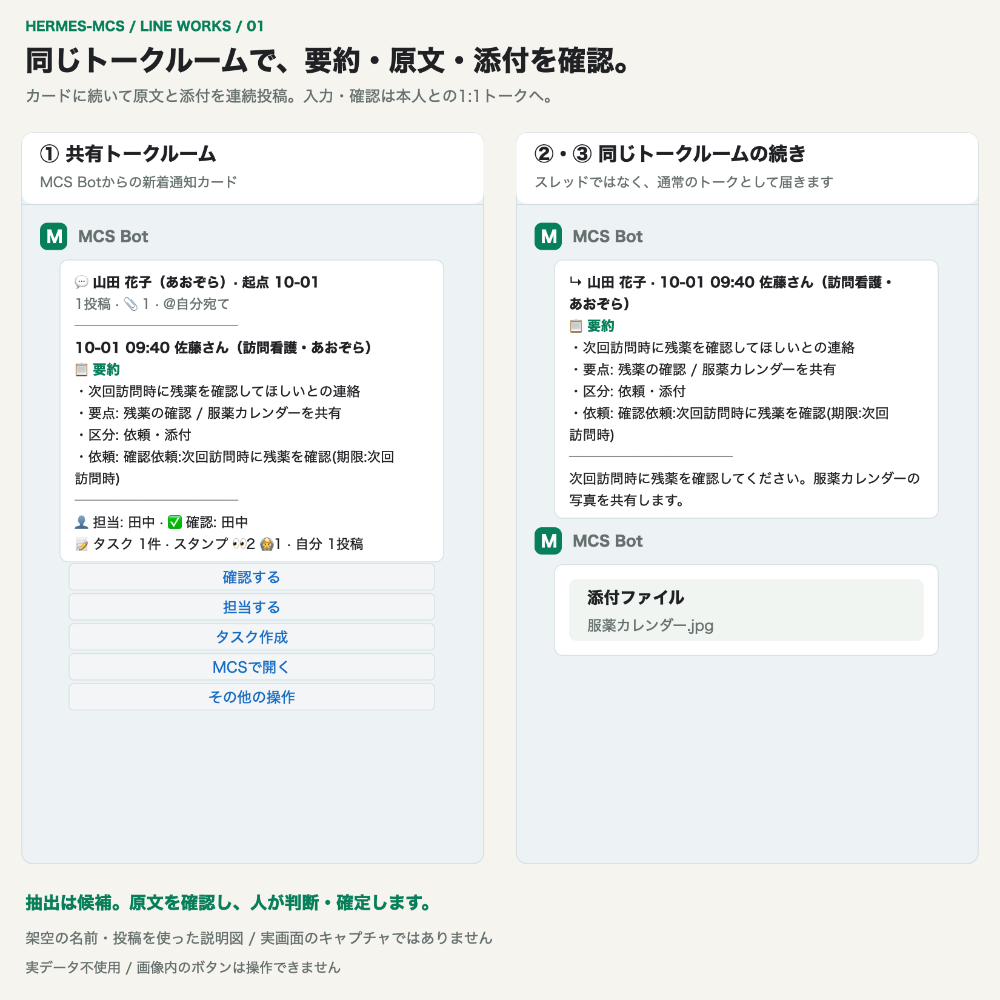
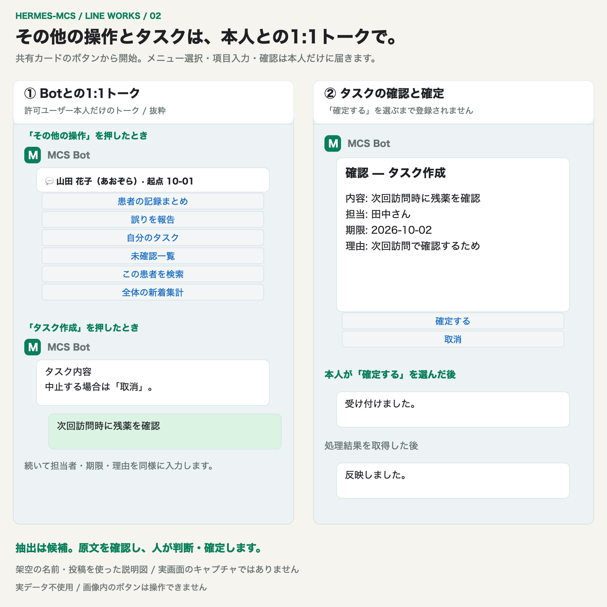

# hermes-mcs

### MCSの連絡を、探せる記録と次の確認へ。

**MedicalCareStation（MCS）の記録を、自分のMacで収集・整理・検索。**
**Slack（推奨）**の通知カードから、連絡の確認、担当の記録、タスクの作成までつなげます。
在宅医療・介護のチームで交わされた相談や経過を、あとからたどるためのローカルシステムです。
Slack・DiscordはHermes公式接続、[LINE WORKS](docs/guides/LINEWORKS.md)は独立した独自アダプターを使います。
Hermesを入れない[スタンドアローンモード](docs/guides/STANDALONE.md)でも、Slack・Discordを含む全機能が動きます。
LINE WORKSでは同じ要約・原文・添付をトークルームの連続投稿で配信します。

[画面を見る](#demo) · [できること](#features) · [使い方を選ぶ](#use-cases) · [導入する](#quickstart) · [データの行き先](#data) · [最新の更新](#release)

| 収集 | 保存・整理 | 通知・操作 |
|---|---|---|
| 24時間・既定5分間隔 | Mac上のSQLite + ローカルLLM | Slack（推奨） / Discord / LINE WORKS |

このREADMEはmainの機能を説明します。導入する版の変更・更新手順は[CHANGELOG](CHANGELOG.md)と[Releases](https://github.com/yusuketakuma/hermes-mcs/releases)で確認してください。
通知を有効にすると患者名・本文・送信対象の添付が設定先へ送られます。[情報の行き先と安全境界](#data)を導入前に確認してください。

<a name="demo"></a>

## 画面イメージ — Slack

**通知先とカード操作はSlackを推奨します。** 要点の確認からタスクの確定まで、7画面で紹介します。
掲載画像の名前・投稿・数値はすべて架空です。実データや実投稿の匿名化例は使用していません。現行実装に基づく説明図で、実画面のキャプチャではありません。



カードで要点を読み、スレッドで原文と添付を確認します。
画像を開くと拡大できます。画像内のボタンは説明用で、実際の操作はSlackの許可ユーザーが行います。

[確認・担当](#slack-card) · [操作メニュー](#slack-menu) · [タスク入力・確定](#slack-task) · [タスク一覧](#slack-tasks) · [患者サマリー](#slack-summary)

<a name="slack-card"></a>

### 確認・担当を、カードから共有



`☐ 確認`・`👤 担当する`の結果をカードに反映します。新しい返信で表示内容が変わると、確認状態も更新されます。
MCSで観測した本人スタンプも、日時付きでカード脚注と未確認一覧に併記します。自投稿は送信者IDで「自分」と表示します。
**カードの確認済み表示やMCSの「完了」スタンプは、正式なタスク完了を意味しません。**

<a name="slack-menu"></a>

### 必要な操作を、メニューから選ぶ



タスク作成、患者サマリー、抽出の誤り報告、自分のタスク、未確認一覧、検索を`操作を選ぶ…`にまとめています。
`☑ タスク完了`などの表示は、カードの状態や設定で変わります。

<a name="slack-task"></a>

### タスクは、入力してから内容を確認・確定

| ① 入力フォーム | ② 本人だけに表示される確認画面 |
|---|---|
| [](docs/screenshots/slack-gallery/04-task-form.png) | [](docs/screenshots/slack-gallery/05-task-preview.png) |
| 投稿に由来する下書きを確認し、担当者・期限・理由を入力して`確認へ`。 | 内容・担当・期限・理由を照合し、`確定する`を選ぶまで登録しません。 |

スタッフ一覧を取得できる場合は担当者を選択できます。一覧がない場合は手入力になります。
期限と理由は任意で、理由が空なら「通知カードからタスク作成」を記録します。
タスク作成はMCSへの依頼投稿を自動化する機能ではありません。

<a name="slack-tasks"></a>

### スレッドのタスクを、対応中・完了へ



未完了タスクがあるカードの`☑ タスク完了`から、このスレッドの一覧を本人に表示します。
対象のタスクを選び、人が`対応中`・`完了`を記録します。本文からAIが抽出した「完了」とも区別します。

<a name="slack-summary"></a>

### 訪問前に、患者サマリーで記録をたどる



`🧾 患者サマリー`から、取得済み投稿の薬・最新バイタル・次回予定・未完了タスク・履歴取得状況を本人に表示します。
**暫定集約であり、確定した処方一覧ではありません。未取得の記録も「無い」とは扱いません。**

[Slackの導入・接続・許可ユーザー設定](docs/guides/INSTALLATION.md) · [操作の詳しい使い方](docs/guides/USER_GUIDE.md) · [画面画像のソースと更新手順](docs/screenshots/slack-gallery/README.md)

<details>
<summary><strong>Discordを使う場合の画面例を開く</strong></summary>


Discordでも通知カードと本文・添付のスレッドを利用できます。
詳細は[利用者ガイド](docs/guides/USER_GUIDE.md)を参照してください。

</details>

<details>
<summary><strong>LINE WORKSを使う場合の画面例を開く</strong></summary>

**要約・原文・添付を、トークルームへ連続投稿**



同じ要約・原文・送信対象の添付を、共有トークルームへ順に配信します。
表示の更新は新しい投稿になり、古いボタンと開いている確認画面は無効になります。

**タスクは、本人との1:1トークで入力・確認・確定**



許可ユーザーがカードから操作すると、入力や回答は本人との1:1トークへ届きます。
タスクは内容・担当・期限・理由を照合し、本人が`確定する`を選ぶまで登録しません。画像内のボタンは説明用です。

[LINE WORKSの導入・接続・許可範囲](docs/guides/LINEWORKS.md) · [画像のソースと更新手順](docs/screenshots/lineworks-gallery/README.md)

</details>

<a name="features"></a>

## できること

| したいこと | hermes-mcsでできること |
|---|---|
| 新しい連絡を確認する | 新着投稿を構造化要約カードで通知。本文・添付はSlack/Discordのスレッド、LINE WORKSの連続投稿で確認 |
| 過去のやり取りを探す | 履歴の保存・全文検索・患者ごとのタイムライン。途中で止まった履歴取得は再開 |
| 長い連絡の要点を読む | 薬・症状・依頼・バイタル・検査値などをローカルLLMとルールで抽出 |
| 患者の記録をまとめて見る | 薬・最新バイタル・次回予定・未完了タスク・MCS連携サマリーを暫定集約 |
| 次に確認する記録を見つける | 処方期間の終了前・終了後や、後続の記録が見つからない状態などをアラートとして提示 |
| 確認・担当・依頼を共有する | カードの確認・担当を記録。タスクは内容と理由を確認してから確定 |
| 全体の傾向を把握する | 投稿量・職種別内訳・未解決依頼などの読み取り専用統計。任意の日次ダイジェスト |

Slackでは通知カードと操作メニューから閲覧・依頼操作を行えます。Discordでは通知カードに加えて`/mcs`コマンドも使えます。
LINE WORKSではカードのボタンから操作し、入力・確認・回答は本人との1:1トークを使います。
`📊 サマリー`から全体・施設・患者・記録上の担当で絞り込めます。Slackは`/mcs-summary`、Discordは`/mcs`の`summary`、LINE WORKSは本人DMの「サマリー」でも呼び出せます。元データは読取り専用スナップショットです。
詳細は[利用者ガイド](docs/guides/USER_GUIDE.md)と[プラグインガイド](hermes_plugin/README.md)を参照してください。

**AIの抽出は候補です。患者サマリーは確定した処方一覧ではなく、カードの確認済み表示もタスク完了を意味しません。**

<a name="use-cases"></a>

## 使い方を選ぶ

<details>
<summary><strong>新着連絡を読み、チームで確認・担当を共有したい</strong></summary>

1. 通知カードの送信者・要約を読み、必要な本文や添付を確認します。Slack/Discordはスレッド、LINE WORKSは同じトークルームの連続投稿です。
2. `☐ 確認`で今の表示内容を確認したことを記録し、必要なら`👤 担当する`で担当を記録します。
3. 作業が必要ならタスクを作り、確認画面で内容・担当・期限・理由を確認して確定します。

新しい返信で表示内容が変わると、確認状態も更新されます。確認記録と実作業の完了は別に扱います。
[カードの操作と表示条件](docs/guides/USER_GUIDE.md)

</details>

<details>
<summary><strong>訪問前に、患者の経過と過去の相談をたどりたい</strong></summary>

患者サマリーで暫定集約を確認し、検索やタイムラインで根拠となる投稿をたどれます。
薬の変更、症状、相談、判断、実施、再評価を、保存済みの記録から確認します。
まだ取得していない範囲は検索されません。履歴の取得状況も合わせて確認してください。
[患者サマリー・検索・タイムライン](docs/guides/USER_GUIDE.md)

</details>

<details>
<summary><strong>後続の記録や期限を、もう一度確認したい</strong></summary>

アラートは「記録上、確認するとよい状態」を提示します。
薬の期間表現や依頼・経過の記録を根拠に、原文を読み、人が確認・判断します。
日次ダイジェストを有効にすると、未完了タスクや滞留アラートなどもまとめて確認できます。
機械がMCSへ依頼を自動送信することはありません。
[アラートの意味・対象・限界](docs/guides/USER_GUIDE.md)

</details>

<details>
<summary><strong>MCSの記録から、どんな傾向を見られる？</strong></summary>

診療と診療の間の多職種コミュニケーションを、次の7分野で扱います。

| 分野 | 記録からたどれること |
|---|---|
| 患者経過 | 症状、バイタル、状態変化、入退院、問題の反復 |
| 薬物療法 | 開始、中止、増減量、期間表現、再評価 |
| 多職種連携 | 誰から誰への相談、回答、判断、実施 |
| 組織間連携 | 薬局・診療所・訪看・居宅のやり取り |
| 時系列 | 記録上の対応時間、変化点、再発間隔 |
| 業務 | 記録の集中、未解決依頼、長期滞留 |
| 確認支援 | 通常との差、フォロー記録が見つからない候補 |

投稿数は重症度を、薬剤名の記載は現在の服用を、記録上の前後関係は因果関係を証明しません。
多職種の多さは連携の質を保証せず、アラートがないことも患者の安全を保証しません。
未来を予測する機能ではありません。[データ一覧と解釈の限界](docs/guides/USER_GUIDE.md)

</details>

<a name="quickstart"></a>

## クイックスタート

**導入前提:** macOS 13以降、普段のユーザー（sudo不要）、Xcode Command Line Tools、Homebrew、空き約12GB、利用権限のあるMCSアカウント。Pythonはインストーラーが用意します。

```bash
git clone https://github.com/yusuketakuma/hermes-mcs.git
cd hermes-mcs
./install.sh --preflight   # 読み取り専用の事前チェック
./install.sh               # 依存一式を導入。途中で止まったら修正して再実行
```

事前チェックのNG行に表示される`fix:`を確認し、`0 blocker(s)`になってから導入します。
初回の`./install.sh`は、Hermes経由かHermesなし（[スタンドアローン](docs/guides/STANDALONE.md)）かを尋ねます。`--mode standalone`で直接指定もできます。
最後の`Installed. Summary:`に表示される`mcs_setup.py init`を、そのままコピーして実行してください。
設定ウィザードが通知先・本体の設定・最終チェックまで案内します。Slack/DiscordではHermesとの同期も行います。
本体の初回設定後は、ブラウザーの準備など診断に残った項目を解消します。LINE WORKSの認証・Callback・常駐設定と再診断は[接続ガイド](docs/guides/LINEWORKS.md)で続けます。
既存環境を更新する場合は[更新エージェント手順](docs/guides/UPGRADE_AGENT.md)を使います。移行先版の更新コードで計画・バックアップ・適用を行い、再導入は必要な場合に明示指定します。

**AIに導入を任せる場合**は、リポジトリを開いたエージェントに次のように依頼できます。

```text
docs/guides/SETUP_AGENT.md に従って、このMacへhermes-mcsを導入してください。
既存設定と回答を再利用し、まず通知先を選んで進めてください。
認証情報は私が端末へ直接入力します。投稿の収集・通知・既読化は開始前に範囲を確認してください。
```

| 次に進む先 | 内容 |
|---|---|
| [Slackを設定する（推奨）](docs/guides/INSTALLATION.md) | Slack app・接続・カード操作・許可ユーザーの設定 |
| [LINE WORKSを設定する](docs/guides/LINEWORKS.md) | 独自接続アダプター・秘密値入力・Callback・許可範囲の設定 |
| [Hermesなしで使う](docs/guides/STANDALONE.md) | `install.sh --mode standalone`・Slack/Discordの直接接続・切り替え |
| [導入ガイド](docs/guides/INSTALLATION.md) | 最短手順・成功の目安・通知先の設定・トラブル対応 |
| [AIエージェント向け導入手順](docs/guides/SETUP_AGENT.md) | エージェントに導入を任せるときの確認・実行手順 |
| [更新・バックアップ・復旧](docs/specs/lifecycle-spec.md) | 導入後の運用と更新時の確認 |

困ったときは、表示された同じインタープリターで`mcs_setup.py doctor`を実行します。

<a name="data"></a>

## 仕組みと情報の行き先


収集した記録をMac上に保存し、ローカルで整理して、通知・検索・統計・アラートとして提示します。

| 経路 | 保存・送信される情報 | 条件 |
|---|---|---|
| このMac | 投稿・添付・患者情報と、ローカルAIによる整理結果 | 収集・保存・構造化抽出の基本経路 |
| Slack（推奨） / Discord / LINE WORKS | 患者名・本文・要約・送信対象の添付。タスク通知には内容・担当者名も含む | 通知先・対話カード・関連機能を設定した場合 |
| TypeSafe Jev API | 本文と必要なスレッド文脈。匿名化なし | 任意・既定OFFの意味チェック／抽出監査を有効にした場合 |
| 知識ストア向けローカル出力 | 患者名・病名・要約・薬剤等を含むMarkdown。匿名化なし | 明示的にエクスポート。出力後の同期・LLM利用は別経路で管理 |

「ローカルLLM」は、システム全体が外部へ送信しないという意味ではありません。
送信先と閲覧権限、AIの使用箇所は[SECURITY.md](SECURITY.md)で確認してください。

### 人が確認して判断するための境界

- **記録がない ≠ 対応していない。** アラートは記録上の候補で、対応漏れを断定しません。
- **人承認を記録。** 依頼登録・更新、アラートの却下、閾値変更は所定の承認とreceiptの記録を伴います。MCSへの依頼送信を自動化しません。
- **保存完了後に既読化。** 取得完了・DBへのcommit・snapshot timestampを条件にします。
- **スタンプは観測情報。** 件数・本人反応・観測日時を本文と分けて保存し、未取得と0件を区別します。取得日時は押下時刻ではありません。スタンプだけで確認・担当・業務完了を変更しません。専用の再取得は既定で無効です。未読保持の実証後に定期shadowを有効化でき、再取得の反応値は通常表示へ反映しません。
- **認証とログの境界。** no-redirect / no-proxy。定期実行のログへ本文・氏名を出しません。明示的な閲覧出力は別に扱います。
- **説明用の架空データだけをリポジトリへ。** 患者データ・秘密情報・実投稿の匿名化例を入れません。

<a name="faq"></a>

## よくある質問

<details>
<summary><strong>AIが処方や医療判断を確定する？</strong></summary>

抽出・要約・アラートは候補です。原文と取得範囲を確認して人が判断します。
投稿から抽出した「完了」と、人がタスク操作で確認した完了も区別します。

</details>

<details>
<summary><strong>添付画像やPDFも解析する？</strong></summary>

添付は保存・通知とメタ情報の管理までで、内容の意味解析は行いません。
長文の要約も全件完了を保証せず、入力上限を超える記録は要確認として扱います。
[解析の限界](SECURITY.md)

</details>

<details>
<summary><strong>バックアップがあれば端末故障にも対応できる？</strong></summary>

日次SQLiteバックアップは同じMac上の保存です。端末喪失時の復旧保証にはなりません。
別媒体への退避と復元手順の確認は運用側で行います。[復旧の限界と手順](docs/specs/lifecycle-spec.md)

</details>

<a name="release"></a>

## 最新の更新

<!-- BEGIN GENERATED:release -->

**v1.0.11 · 2026-10-03** — **MCSスタンプの観測表示と絞込みサマリー・更新手順**

本人スタンプの観測表示とID判定を追加し、日次サマリー・絞込み・本人向け呼出しを共通化します。移行先版のコードで更新でき、DB更新は人承認付き、新しい再取得は既定で無効です。

<details>
<summary>主な変更と更新時の注意を開く</summary>

- **新機能 · MCSスタンプと投稿メタ情報を分離して保存**
  既存の収集応答に含まれるスタンプ件数・本人反応・メンション・しおり・ピン留めを保存します。未取得と0件を区別し、不正なメタ情報があっても本文収集を継続します。

- **不具合修正 · スタンプ脚注付きカードの文字数上限を維持**
  投稿や担当・確認・依頼の情報が多いカードでも、見出しとスタンプ脚注を含めて送信上限内にページを分けます。脚注の追加でカード全体が送信保留になる問題を修正し、投稿は別ページと本文表示から確認できます。

**更新時の注意**

- 追加設定は不要です。カード表示の反映には、利用中のHermes gatewayまたは独立アダプターの再起動が必要です。通知先・確認・担当・依頼の承認条件は変更しません。今回の作業では再起動していません。

- 追加設定は不要です。既存プロフィールのID補完は自局名簿の次回取得時に行い、保存済みの患者集約は次回の集約処理で再構築します。シグナルの自局・職種設定と応答判定は変更しません。

- 追加操作は不要です。daily_digest.scopeの日数指定時は指定期間を毎回集計するため期間が重複し得ます。日数未指定時は従来どおり前回の配信終端から集計します。

- DBは起動時にschema 8へ加法移行します。schemaを上げるため自動更新は適用せず、人承認付きの更新経路を使います。更新前バックアップを保持してください。メタ情報専用の再取得は既定で無効です。契約と未読保持を実証した後、metadata_shadow=trueで定期shadow、または --metadata-shadow で手動shadowを実行します（最大5件・最大25秒・末尾30秒確保、成功後30分・失敗後6時間）。Hermes pluginはgateway再起動、独立モードはhost再起動で反映します。既存の既読化条件・抽出モデル・通知先・人承認条件は変えません。

- 追加設定は不要です。不整合な応答は失敗または未確認として再確認してください。MCS実画面・実APIの最終確認はユーザーが担当します。

- 追加設定は不要です。診断結果が不完全な場合は、失敗または未確認として再確認してください。この修正はローカルの合成テストで検証し、MCS実画面・実APIの最終確認はユーザーが担当します。

- Hermesでカード表示を更新する場合はgatewayの再起動が必要です。独立アダプターも起動中のプロセスを再起動してください。日次ダイジェストは既存の有効化設定に従い、既定では無効のままです。観測日時は押下時刻ではなく、スタンプから業務確認・担当引受・完了を自動実行しません。旧snapshotでは未取得と表示します。

- 設定変更は不要です。更新処理を実行するコードの反映後から適用します。稼働サービスの再起動は今回実施していません。

- Hermes連携のSlack・Discordは更新後にHermes Gatewayを再起動してください。LINE WORKSは独立アダプターを再起動してください。再起動前の旧アダプターでは📊ボタンが正しく動作しません（Slackは「操作できません」、Discord・LINE WORKSは結果の無い応答になります）。日次ダイジェストの対象は任意のdaily_digest.scopeで絞れます（既定は全患者、mineは指定不可）。通知先・送信時刻・患者名の既定（include_names=false）・既読化・人承認・取得範囲・モデルは変更しません。

- Hermes連携のSlack・Discordは更新後にHermes Gatewayを、LINE WORKSは独立アダプターを再起動してください。Slackの/mcs-summaryを使う場合はSlackアプリにslash commandとcommands scopeを追加して再インストールし、plugin settingsのsnapshotを設定します（導入ガイド付録B）。日次サマリーの送信先はカード通知が有効ならカード用の配送先、無効なら従来どおりnotify_targetです。DBはnotification_renders.intent_event_id列を追加します（加法）。この版より前へ巻き戻すと、未封印のカード版日次サマリーはその日の分が送られず、封印済みで未送の分は送信されても完了扱いにならず通知キューに残ります（翌日分の投入後は手動で整理してください）。Discordの/mcsのサマリーは返答の公開範囲が実機で未確認のため患者名を出しません。既読化・人承認・取得範囲・モデル・患者名の既定（include_names=false）は変更しません。

- 追加操作は不要です。v1.0.11以降への更新でUPGRADE_AGENT.mdの手順が使えます。v1.0.0〜1.0.2からは同書の手動経路を使います。自動更新とSlack等の承認経路はinstall.sh変更を含む版を従来どおり適用しません。独立モードの外部適用は未対応で、host経由の更新を使います。既読化・人承認・取得範囲・モデルの既定値は変更しません。

</details>

[すべての変更と技術詳細](CHANGELOG.md) · [GitHub Releases](https://github.com/yusuketakuma/hermes-mcs/releases)

<!-- END GENERATED:release -->

<a name="docs"></a>

## ドキュメント

| 読む目的 | 文書 |
|---|---|
| 使い方・画面・データの読み方 | [利用者ガイド](docs/guides/USER_GUIDE.md) |
| 導入・接続・設定・トラブル対応 | [導入ガイド](docs/guides/INSTALLATION.md) · [LINE WORKS接続](docs/guides/LINEWORKS.md) · [スタンドアローン](docs/guides/STANDALONE.md) · [エージェント向け手順](docs/guides/SETUP_AGENT.md) |
| データ取扱い・安全境界・AI・復旧の限界 | [SECURITY](SECURITY.md) |
| 更新・バックアップ・復旧 | [ライフサイクル仕様](docs/specs/lifecycle-spec.md) · [配備資産](deployment/README.md) |
| 開発・コマンド・統計・アラート定義 | [開発リファレンス](docs/development/DEVELOPMENT.md) · [Hermesプラグイン](hermes_plugin/README.md) |
| エクスポート・意味解析の評価 | [外部出力契約](docs/specs/external-export-contract.md) · [意味解析の評価](docs/specs/semantic-evaluation.md) · [rollout](docs/specs/semantic-facts-v2-rollout.md) |
| 今後の計画 | [ロードマップ](docs/ROADMAP.md) |
| リリースとREADMEの更新ルール | [リリースノート規則](docs/development/RELEASE_NOTES.md) · [README運用](docs/development/README_MAINTENANCE.md) |

## ライセンス

Private repository — 現時点で公開・再配布は想定していません。
利用・改変はリポジトリ管理者の明示許可に従ってください（[LICENSE](LICENSE)）。
