# 利用者ガイド — hermes-mcs

利用者・責任者向けの詳細ガイド（画面イメージ・できること・仕組み・MCS データで何が追えるのか）。
README.md を短くした際に、README にあった利用者向けの詳細（記述は移設時点のまま）をここへ移した。
導入・運用は [INSTALLATION.md](INSTALLATION.md)、開発・運用リファレンスは
[DEVELOPMENT.md](DEVELOPMENT.md)、データの行き先と限界は [SECURITY.md](../SECURITY.md) を参照。

## 画面イメージ

通知は **Discord / Slack** のどちらにも同じカード形式で届きます。
Slack ではモバイルで場所を取らないよう、ボタンは「☐ 確認」「👤 担当」の2つだけにし、
ほかの操作は「操作を選ぶ…」メニューにまとめ、MCS へのリンクはカード下部の文字リンクで表示します。
カードには送信者行と構造化要約だけを載せ、本文全文と添付ファイル
（画像・PDF 等）はカードのコンパニオンスレッドへ配送します。

**Discord — 通知カード（送信者行・構造化・操作ボタン）**

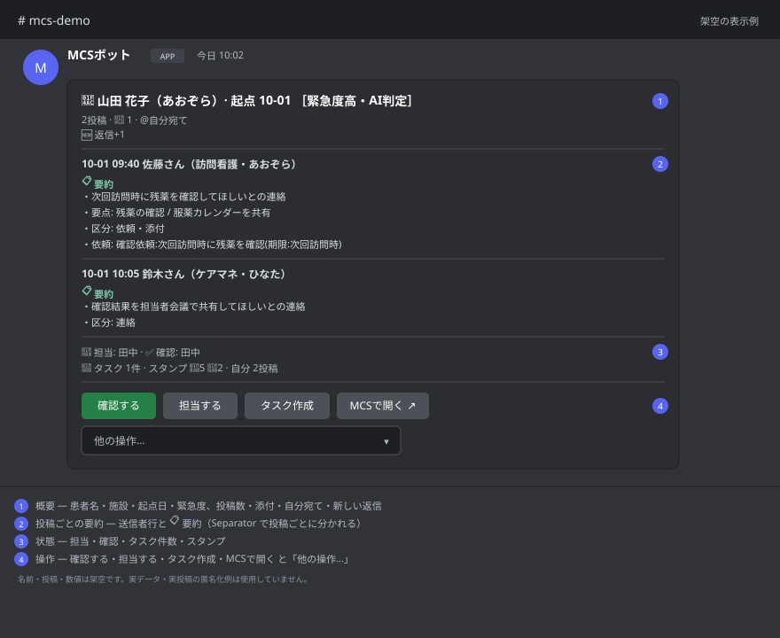

**Discord — 本文・添付はコンパニオンスレッドへ配送**

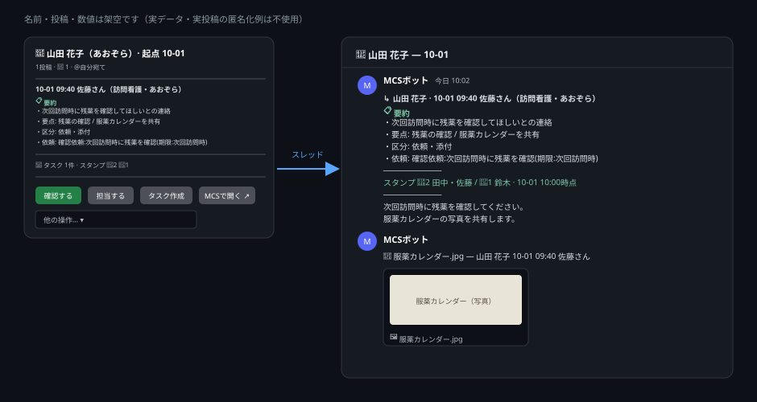

**Slack — 通知カード（構造化フィールド・操作ボタン）**

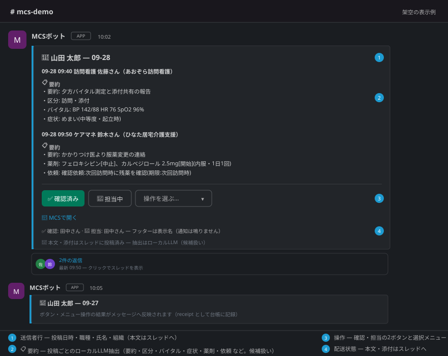

**Slack — 本文・添付はスレッドへ配送**

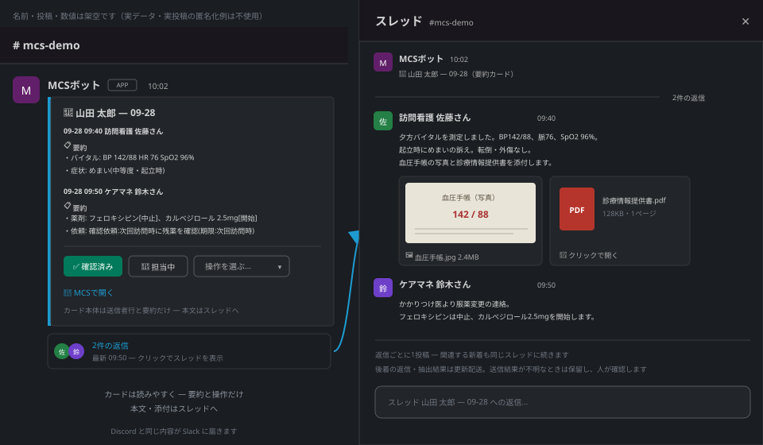

`📋 構造化` ブロックはローカルLLMの抽出（要約・要点・区分・バイタル・
症状・依頼）をコンパクトに提示する「候補」です。本文はカードには
載せず、`notify.card_thread` がオンの場合（`init` の既定はオン）は
カードごとに専用スレッド（`💬 患者名 — MM-DD`）を立て、表示対象の
本文全文と添付をリアルタイムでスレッド内へ投稿します。配送は
ジャーナル化された parts（card→thread→本文chunk→添付）で、worker
再起動後も中断点から再開し重複投稿しません。構造化の抽出結果が後から届くなどして
本文が変わったときは、投稿を増やさず同じ投稿を書き換えます（書き換えでは通知は鳴りません）。スレッドを持てない
カード（オフ・作成失敗・削除済み）では `📄 本文表示` が残り、押した
本人のみに全文を ephemeral 表示します。

#### カードのボタン（Discord / Slack 共通）

ボタンの表示は状態に合わせて変わります。フッターには操作した人が
名前で表示されます（Discord はメンション表示で通知は鳴りません。
Slack は表示名の文字列で、取得できない場合は「メンバー」と表示されます）。

| 行 | ボタン | 動き |
|---|---|---|
| 1 | `☐ 確認` ⇄ `✅ 確認済み` | 今表示している内容を誰かが確認すると緑の `✅ 確認済み` に変わり、フッターに `✅ 確認: <名前>` が並びます。確認済みの本人がもう一度押すと自分の確認を取り消します（記録は取消として残ります）。新しい返信が来るなど内容が変わると `☐ 確認` に戻ります。まとめカードでは `☐ このページを確認` ⇄ `✅ このページ確認済み` |
| 1 | `👤 担当する` ⇄ `👤 担当中` | 押した人が担当になり、フッターに `👤 担当: <名前>`。担当中の本人が押すと担当を外し、別の人が押すと担当を引き継ぎます（押した表示の後に担当者が変わっていた場合は引き継がず、最新の表示でやり直すよう案内します） |
| 1 | `📄 本文表示` | スレッドを持てないカードだけ。本文全文を押した本人にだけ表示 |
| 2 | `📝 タスク作成` | この投稿を起点に薬局内タスクを作ります。入力欄は「タスク内容」（投稿から抽出した依頼があれば下書きとして入っています）・「担当者」（MCS から取得した自局スタッフ一覧から選択、または手入力）・「期限」（YYYY-MM-DD、任意）・「理由」（任意。空なら「通知カードからタスク作成」を記録）。確認画面には理由も表示され、「確定する」を押すまで登録されません。登録後、カードのフッターに `📝 内容 — 担当 名前 — 期限 日付` が並びます（3件まで、以降は「他N件」） |
| 2 | `☑ タスク完了` | このスレッドに未完了タスクがあるときだけ表示。押した本人にタスク一覧が表示され、各タスクを「対応中」「完了」に進められます |
| 2 | `🧾 患者サマリー` | 押した本人にだけ、取得済み投稿からの**暫定集約**（抽出された服用中の薬と処方期間・最新バイタル・次回予定・未完了タスク・履歴の取得状況）を表示します。処方期間・次回予定は投稿から抽出した表現で、確定した処方ではありません。取れていない記録は「無い」ではありません |
| 2 | `⚠ 抽出の誤りを報告` | 構造化抽出の誤りを報告します（箇所: 要約/薬/症状/依頼/バイタル/その他 ＋ 任意メモ）。確認画面で確定すると、その投稿の抽出を1回だけ再実行し、再抽出されるまでカードに `⚠ 誤り報告あり` と表示されます |
| 2 | `🚫 却下` | レビュー候補カードのみ。却下理由を一覧（誤検知 / 対応済み / 重複 / 対象外 / その他）から選び、任意でメモを添えて却下。確認画面で確定するまで記録されません |
| 3 | `🔗 MCSで開く` | その患者の MCS の画面を開くリンク |
| 3 | `◀ 前へ` `次へ ▶` | 複数ページのカードのみ |
| 4 | `📋 自分のタスク` | 押した本人にだけ、自分が担当の未完了タスク（未着手・対応中）を全患者分表示。期限切れを先頭に、期限の早い順。担当者欄が Discord の表示名（または `📝` のスタッフ一覧で選んだ「氏名（事業所）」）と一致するものだけが対象です（下の注意） |
| 4 | `🗂 未確認一覧` | 押した本人にだけ、直近7日に更新されたカードのうち今の内容に `✅ 確認` が付いていないもの（担当中で未確認のものは `担当中` 付き）を患者ごと・古い順に表示。MCS とカードへのリンク付き、15件を超える分は「他N件」。**確認ボタンの記録の有無であり、作業が済んだかどうかではありません** |
| 4 | `🔎 この患者を検索` | キーワード（空白区切りで AND）を入力すると、その患者の取得済み投稿から一致したものを新しい順に10件まで、日時・職種・前後の抜粋付きで押した本人にだけ表示。**まだ取得していない範囲は検索されません**（履歴の取得状況を併記） |

4行目のボタンは、カードの部品数が Discord の上限（40）に近いときは
入る分だけ表示されます。

- **`📋 自分のタスク` の対応づけ**: 押した人の表示名（Discord はサーバーでの
  表示名、Slack はプロフィールの表示名・無ければ氏名。取得できない
  ときだけユーザー名）とタスクの担当者欄を、空白の違いを無視して
  照合します。担当者欄が「氏名（事業所）」の形なら氏名部分で照合します。
  手入力の略称・旧姓・別表記、表示名が MCS の氏名と違う場合は一致しません。
  表示名は本人が変えられるため、本人確認の仕組みではありません
  （タスクはもともとチャンネルの許可メンバー全員が見られる情報です）。

- **朝の日次ダイジェスト**（`daily_digest.enabled`、既定オフ）: 毎朝
  `daily_digest.hour_jst` 時（既定8時・JST）以降の最初の実行で1通、
  `notify_target` に送ります。前回のダイジェスト以降の新着件数（職種別）、
  緊急度が高い投稿の ID（project / message。本文は出しません。患者名は
  `daily_digest.include_names` をオンにしたときだけ ID に添えます）、
  取得未完了として記録されたルームと理由コード（0件でも欄を出します）、
  open（未解決）の確認候補の型別件数（`signals.notify` がオンのときだけ。
  依頼・期限系の3型は除外）、未完了・期限切れタスク数です。件数は取得済みの
  記録から数えたもので、記録がないことは対応がなかったことを意味しません。
- **期限リマインド**: 通知カード（スレッドカード）がまだ有効な投稿に
  紐づく未完了タスク（カードの `📝` で作ったもの・`/mcs` で登録したものの
  どちらも）に期限があると、期限当日に1回 `⏰ 期限リマインド`、期限を
  過ぎても未完了なら1回 `⚠ 期限切れ` を通知先（`notify_target`）に投稿
  します（8〜21時のみ、1回の実行で最大3件ずつ）。投稿には**患者名・
  タスク内容・担当者名**が含まれます。期限を変更すると新しい期限で
  もう一度リマインドされます。機能が初めて有効になった時点で既に期限を
  過ぎていたタスクはまとめて投稿せず、記録だけします（以後に期限を
  迎えたものだけを通知）。カードのフッターでも期限切れのタスクに
  `⚠ 期限切れ` が付きます。
- **緊急度の表示**: `📋 構造化` の先頭に、ローカルLLM抽出が緊急と判定した
  投稿は `緊急度: 高（AI抽出）`、ルール照合だけが緊急語を見つけた投稿は
  `緊急語を含む（機械照合）` と出所付きで表示します。ルール照合は
  「急変なし」のような否定表現にも反応することがあります。
- **押せる人**: 管理者が許可したユーザー（Discord はユーザーID またはロール、
  Slack はユーザーID）だけが操作できます。許可されていない人が押すと
  本人にだけ「権限がありません。」と表示されます。
- 以前のカードに残っている `⏸ 保留` / `📋 タスク` ボタンも押せます
  （保留は廃止済みの案内を表示してカードを最新のボタンに更新、
  タスクは一覧を表示）。

**CLI — 取込状況・タイムライン（`mcs_view.py status` / `timeline`）**

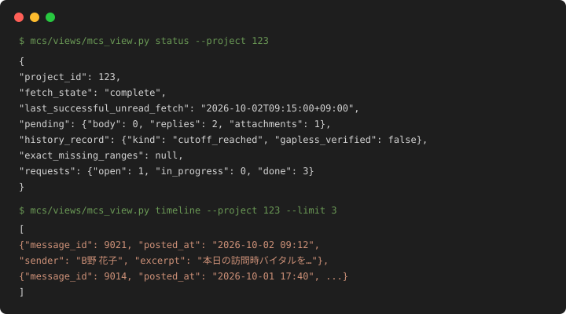

**CLI — レビュー候補シグナル（`mcs_view.py signals`）**

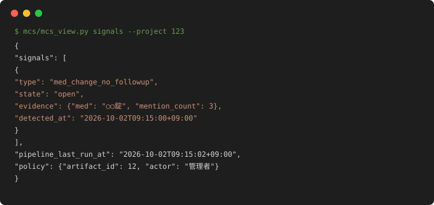

## このシステムが助けること

医療・介護の現場で起きがちな問題に対応します:

- **見逃しを減らす** — MCS を開いて巡回しなくても、新しい連絡が
  通常5分以内（夜間は最大20分）に Discord に届きます
- **「あの話はいつだっけ」をすぐ探せる** — 患者ごとの全履歴を保存
  するので、薬の話題が出た時期や経緯を全文検索・タイムラインで
  辿れます
- **フォローの抜けに気づく** — 「薬が変わったのに様子の記録が
  見つからない」「退院・転院の記録の前後で薬の変更が重なっている」
  など、目視では拾いきれない確認候補を機械が列挙します
- **判断は人が行う** — 機械の整理結果は「候補」の提示まで。
  登録・確定は必ず人の確認を経ます

## できること一覧

| できること | 内容 |
|---|---|
| 新着連絡の通知 | 5分ごと（夜間は20分間隔）にMCSを確認し、新しい投稿をDiscordに転送（構造化要約カード。本文・添付はカードのコンパニオンスレッド内に投稿） |
| 全履歴の保存 | 過去の投稿を遡って全件保存。途中で止まっても続きから再開 |
| 検索・タイムライン | 患者ごとの時系列表示と全文検索（日本語の表記ゆれに対応） |
| 内容の自動整理 | 薬・症状・依頼・バイタル値などを機械が拾って構造化 |
| 患者ごとの一覧 | 患者単位で「現在の薬・最新のバイタル・未解決の依頼・次回予定」をまとめて表示 |
| 統計 | 投稿量・職種別の内訳・薬剤関連の集計（元の記録を一切変更しない読み取り専用） |
| 確認候補の提示 | 「後続の記録が見つからない」等の候補を列挙（対応漏れの断定ではない） |
| 依頼の台帳 | 人が確認した内容だけを台帳に登録。MCSへ自動で送信することはない |
| Discord からの操作 | `/mcs` コマンドで閲覧・依頼の確認（Hermes addon 経由） |

## 仕組み

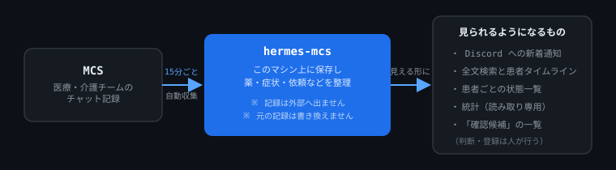

1. **収集** — 5分ごと（夜間22-06時は20分間隔）に MCS を確認し、新しい記録をマシン上の
   データベースに保存します
2. **整理** — 保存した記録から、薬・症状・依頼・バイタル値などを
   機械が拾って構造化します（間違えることもあるため「候補」扱い）
3. **提示** — Discord 通知・検索・統計・確認候補として、人が
   見られる形にします

収集した記録の保存と構造化抽出はローカルで行います。通知を設定した
場合は本文・要約と送信対象の添付を Discord 等の設定先へ送ります。
任意の意味チェック・抽出監査を有効化した場合は、本文と必要なスレッド
文脈を TypeSafe Jev API へ送ります。「ローカルLLM」はシステム全体の
外部送信禁止を意味しません。

**実際に稼働している構成**

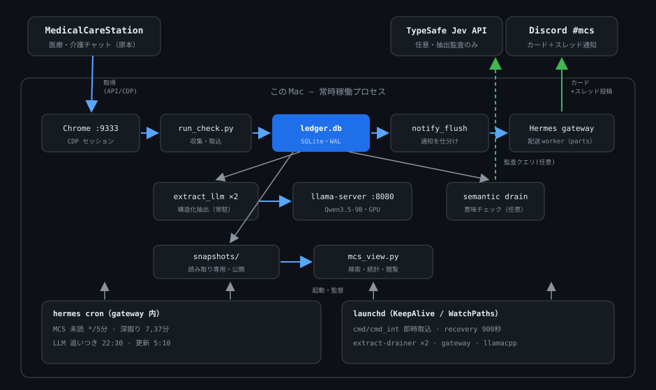

情報の行き先（AI の使用箇所・外部送信の有無）の詳細と現在の機能・運用上の制約は
[SECURITY.md](../SECURITY.md)「人工知能（AI）の使用箇所と情報の行き先」「復旧と解析の限界」、
技術的な構成（システム構成図・ローカルLLM と TypeSafe Jev の技術詳細）は
[DEVELOPMENT.md](DEVELOPMENT.md) の「付録: README から移設した技術詳細」を参照。

## MCS データで何が追えるのか

### なぜ MCS データか — 既存データ源との補完関係

医療データ源はそれぞれ「見えるもの」が違う。MCS は診療行為の記録ではなく、
**診療と診療の間の多職種コミュニケーション**を残す:

| データ源 | 得意なこと | 見えにくいこと |
|---|---|---|
| レセプト | 診療行為・処方・算定・患者数 | 判断に至る過程 |
| 調剤・処方 | 何が処方・調剤されたか | なぜ変更されたか |
| 電子カルテ | 診療記録・検査・処方 | 施設横断の日常的連携 |
| 訪問記録 | 訪問時の評価 | 訪問と訪問の間 |
| **MCS** | **症状→共有→相談→判断→実施→再評価の流れ** | MCS 外の電話・診療等 |

優劣ではなく補完関係。MCS は「地域包括ケア・多職種連携のための
コミュニケーションツール」として設計されており、患者ごとの情報が
時系列で残り、施設・地域を越えて多職種が共有する点が特徴。

### メディカルチャットから縦断データへ


### 測定できること

7つの分野でデータが取れます。各項目を開くと、「何がわかるか」
「どんな場面で役立つか」が確認できます。

| 分野 | 得られるデータ例 |
|---|---|
| 🧑‍⚕️ 患者経過 | 症状、バイタル、状態変化、入退院、問題の反復 |
| 💊 薬物療法 | 開始、中止、増減量、期間表現、再評価 |
| 💬 多職種連携 | 誰→誰への相談、回答、判断、実施 |
| 🏥 組織間連携 | 薬局・診療所・訪看・居宅間のやり取り |
| ⏱ 時系列 | 対応時間、変化点、再発間隔 |
| 📊 業務 | 記録の集中、未解決依頼、長期滞留 |
| 🔎 確認支援 | 通常との差、フォロー記録不足候補 |

🧑‍⚕️ 患者経過 — 何がわかるか

**わかること**

- 症状の経過 — 「新しく出た」「続いている」「治った」「過去のもの」を
  区別して記録。「発熱なし」のような否定も症状ありと混同しない
- バイタルの値 — 体温・脈拍・呼吸数・血圧・SpO2・血糖の数値と
  その変化
- 出来事 — 訪問・検査・入院・退院・転院・転倒・終末期・ケア・
  家族連絡の10種に分類。「退院できません」は退院として誤計上しない
- 投稿の要点 — 各投稿の50字要約と「次に知るべき要点」最大3件
- 至急度 — 緊急を要する投稿か通常の投稿か
- 根拠の確認 — 各項目に本文中の根拠箇所が記録されるので、
  「どこを読んでそう判断したか」を原文で確かめられる

**役立つ場面**: 「あの患者の発熱、いつからだっけ」「退院の話はいつ
出たっけ」を遡って確認したいとき、長いスレッドを全部読まずに
要点だけ追いたいとき。

💊 薬物療法 — 何がわかるか

**わかること**

- 薬ごとの操作 — 開始・中止・増量・減量・変更の言及を薬剤名と
  用量つきで記録
- いつの話か — 現在飲んでいる・過去のもの・これから検討中、を区別
- 誰の薬か — 本人の処方か、家族の薬か、を区別（家族の薬が本人の
  処方として集計に混ざらない）
- 否定の言及 — 「もう使っていない」は中止として処理し、
  服用中として数えない
- 期間表現 — 「9/1-9/21」型の期間が書かれた処方の終了間近を検出
- 残薬・飲み忘れの兆候

**役立つ場面**: 処方変更の後に経過観察の記録があるか確認したいとき、
退院・転院の前後で薬の変更が重なっているか確認したいとき。
「ロキソニン」と「ロキソプロフェン」のような表記ゆれの統合は
まだできません（表記のまま集計されます）。

💬 多職種連携 — 何がわかるか

**わかること**

- 誰が誰に依頼したか — 依頼者・宛先・内容・期限を記録
- 職種ごとの関与 — 投稿者の職種（医師・看護師・薬剤師・ケアマネ等）と
  所属組織
- 会話の流れ — どの投稿がどの投稿への返信か、誰が話に登場したか
  （家族の発言・患者本人の声を区別）

**役立つ場面**: 「あの依頼、誰に出したっけ」「返事は来ていたか」を
確認したいとき、連携が特定の人に偏っていないか見たいとき。

**設計上の慎重さ**: 同じ患者のチャットルームに投稿しただけでは「直接
やり取りした」とは判定しません — 依頼・返信・記録された出来事の
つながりを証跡として扱います。

🏥 組織間連携 — 何がわかるか

**わかること**

- 施設をまたいだやり取り — 薬局・診療所・訪問看護・居宅・病院の
  間で交わされた投稿と返信の組み合わせ

**役立つ場面**: 「どの施設とどの施設が実際に連携しているか」
「紹介後に情報が届いているか」を記録から確かめたいとき。

⏱ 時系列 — 何がわかるか

**わかること**

- 投稿日時が確認できる記録を使い、以下を後から計算できる
  （日時不明の記録は区別して扱う）:
  - 相談から回答までの時間
  - 症状報告から対応までの時間
  - 同じ問題が繰り返し起きる間隔
  - 記録が集中した期間・変化が起きた時点

**役立つ場面**: 「連絡してから対応までにどのくらいかかっているか」
を振り返りたいとき、報告書・研究用に経過を時系列で整理したいとき。

📊 業務 — 何がわかるか

**わかること**

- 記録の集中 — 直近72時間で記録が急増しているチャットルームの検出
- 依頼の滞留 — 未完了のまま期限を過ぎた依頼、長期間未完の依頼
- 曜日・時間帯の分布 — 夜間や休日に連絡が集中していないか
- 投稿の偏り — 記録が特定の人に集中していないか

**役立つ場面**: 「見落としそうな依頼はないか」「夜間の連絡負担は
どのくらいか」を把握したいとき、業務量の偏りを見直したいとき。

🔎 確認支援 — 何がわかるか

**わかること** — 「確認した方がよいかもしれない」候補を提示:

- 期限を過ぎた・長期間未完の依頼
- 薬の変更言及後に後続の記録が見つからない件
- 直近で記録が集中しているチャットルーム
- 期間表現の終了が近い処方
- 退院・転院の前後で薬の変更が重なる件

各候補には「未確認→確認済み」の状態管理と、人による却下・
閾値変更（理由と操作記録つき）が付きます。

**役立つ場面**: すべての記録を読み返さなくても、確認が必要そうな
ところに絞って目を通したいとき。候補は断定ではなく、必ず原記録の
確認を求める設計です。

### 蓄積・集計できるデータの全体像

このシステムにたまる情報を、性質ごとに分けた一覧です。
「記録されている」「機械が抽出した」「集計できる」「確認候補として表示する」
「人が承認した」は別物として区別して扱います。

#### A. 記録そのもの（元データ）

| データ | 内容 |
|---|---|
| 投稿メタ情報 | 投稿日時・投稿者名・職種・所属組織・どの患者のチャットルームか |
| 本文 | 全文。スレッドの親子関係（どの投稿への返信か）付き |
| 添付ファイル | ファイル名・サイズ・hash・取得状態。内部台帳には再取得用URLとローカル保存先も保持するため、閲覧権限を管理する |
| 取得状態 | 本文を取得済みか・一部だけか、内容hash（編集されたかの検知用）、最初に見つけた日時・最後に更新を確認した日時 |

#### B. 機械が自動で整理する項目（2レーン）

**スピードレーン・ルール抽出（全投稿・常時実行）** — 決まった文字パターンで拾う。
即時解析で通知・シグナルがLLM待ちにならない:

| 項目 | 内容 |
|---|---|
| イベント・日付 | イベント種別、訪問日、次回予定日 |
| 薬 | 薬剤名＋用量、開始/中止/増減量/変更、「9/1-9/21」型の期間表現 |
| バイタル | 血圧・体温・脈拍・呼吸数・SpO2・血糖 |
| 症状・服薬 | 症状の語、残薬・飲み忘れ等の兆候 |
| 依頼・登場者 | 依頼（宛先・内容）、家族の発言・患者本人の声・対話の有無 |
| 記録の形 | SOAP の各要素の有無、緊急度フラグ |

**品質レーン・ローカルLLM 抽出 v3（差分のみ・このマシン上で実行）** —
文脈を読んで整理。ルール抽出結果を候補としてプロンプトに載せ、
同じパスで `extract_v1` artifact も保証する（v1+v2 の処理を v3 が兼務）:

| 項目 | 内容 |
|---|---|
| 薬 `meds` | 薬剤名・用量・操作（開始/中止/増減量等）・**現在/過去/予定**・**本人の薬か家族の薬か**・否定（「使っていない」）・根拠箇所 |
| 症状 `symptoms` | 症状名・新規/継続/治った/過去・否定・根拠箇所 |
| イベント `events` | 10種に分類（訪問・検査・入院・退院・転院・転倒・終末期・ケア・家族連絡・その他） |
| 依頼 `requests` | 誰へ・誰から・内容・期限 |
| バイタル `vitals` | BT/HR/RR/SBP/DBP/SpO2/BS の数値 |
| 要約 `summary`/`points` | 50字以内の要約、次に知るべき要点（最大3件） |
| 緊急度 `urgency` | 至急か通常か |
| 根拠 `evidence` | 全項目に本文中の根拠箇所（完全一致引用）を記録 — 後から「どこを読んでそう判断したか」を確認できる |
| QC 注記（任意・既定OFF） | 本文の裏付けを別途判定。裏付け不足等は後続のローカル再抽出を1回行い、成功時に抽出結果を置換 |

#### C. 患者ごとのまとめ（rollup）

患者単位で再構築した現在の姿: 最新バイタル・現在の薬と期間・薬剤一覧・
直近の症状（「なし」の統合済み）・未解決の依頼・次回予定・最終活動日時・
投稿者の内訳・削除された可能性のある投稿。

#### D. 確認候補シグナル（11種）

記録から「確認した方がよいかもしれない」候補を提示。対応漏れの断定ではなく、
各候補は open→resolved（確認済み）の状態管理付き。

| 候補 | 内容 |
|---|---|
| `request_overdue` | 期限を過ぎた未完了の依頼 |
| `request_aging` | 登録から長期間（既定30日超）未完の依頼 |
| `med_change_no_followup` | 薬の変更言及後、一定期間内に後続の記録が見つからない件（チャットルーム×薬） |
| `pharmacist_request_unanswered` | 薬剤師宛の依頼言及の後に、応答の記録が見つからない件 |
| `rx_request_visibility` | 他職種宛の処方関連依頼の言及を、先に把握するための情報 |
| `adherence_concern` | 飲み忘れ・残薬など、服薬管理の困難を示す言及 |
| `discharge_notice` | 薬の変更との重なりがない退院・転院の言及 |
| `symptom_after_med_change` | 同じ投稿に薬の変更と新規・継続症状が記録された件（因果関係は未確定） |
| `comm_concentration` | 直近72時間で記録が集中しているチャットルーム |
| `rx_period_expiry` | 「9/1-9/21」型の期間表現の終了が近い件 |
| `transition_reconciliation` | 退院・転院の前後に薬の変更言及が重なる件（照合したかは人が判断） |

#### E. 依頼台帳（人の承認でのみ登録）

件名・担当者・期限・状態（未着手/対応中/完了/取消）・版・元記録へのリンク・
操作記録（誰が・いつ・理由）。機械が勝手に登録・変更することはない。

#### F. 集計統計（一覧は [DEVELOPMENT.md](DEVELOPMENT.md)「統計（読み取り専用）」参照）

投稿量・職種内訳・曜日×時間帯の分布・投稿の集中度・薬剤の月別言及・
後続記録が確認できない件数・依頼の滞留・退院前後の薬変更の重なり 等。

#### G. 閲覧・検索の切り口

本文の全文検索（日本語対応）・患者タイムライン・スレッドの時系列・
添付一覧・抽出候補の一覧・open-loop 候補 — すべて読み取り専用で、
原本への書き戻しはしない。

#### H. 運用・監査の記録

収集の実行履歴・履歴取込の進捗（どこまで読んだか）・既読化の記録・
操作 receipt・通知の送信キュー・Jev 呼出量（日次上限の内訳）。

#### まだ取れないもの（「取れない」と「ゼロ」を区別）

| 項目 | 状態 |
|---|---|
| アドヒアランス問題の極性つき集計 | 材料（`valid_facts`）未整備 → 統計は `unavailable` を返す |
| 薬剤名の成分レベル正規化 | 辞書（`drug_map`）未整備 → 表記のまま集計 |
| 本文由来の依頼滞留の経過日数 | 紐付け（`interaction_links`）未整備 → 正式依頼のみ集計 |

「対象なし（0件）」と「情報不足で判定不能」は別の結果として表示します。

### メッセージではなく症例経過


hermes-mcs はこの流れを単なる6投稿としてではなく、
**症状 → 評価 → 提案 → 判断 → 実施 → 再評価** という一つの症例経過として
扱う。型付きイベントと薬剤アクションの共起解析
（`transition_reconciliation` 等）がこの復元を支える。

### 多職種連携の解析

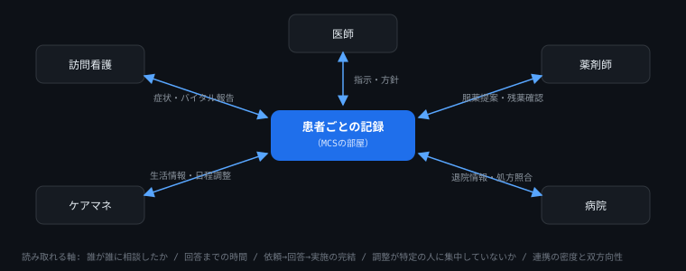

すべての職種が同じ患者の記録に書き込むため、「誰が誰に相談したか」
「相談から回答までの時間」「依頼が回答・実施まで完結したか」
「調整役が特定の人に集中していないか」といった連携の形を記録から
読み取れます。

> **注意**: この図はつながりの模式図です。実際の解析では
> 「同じ患者のチャットルームに投稿しただけ」では直接のやり取りと判定
> しません — 依頼・返信・記録されたイベントのつながりを使います。

### 縦断症例解析

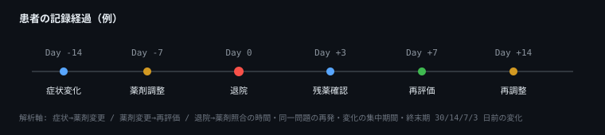

解析可能な軸: 症状→薬剤変更までの時間、薬剤変更→再評価までの時間、
退院→薬剤照合までの時間、同一問題の再発、薬剤変更・多職種連携が
集中する期間、終末期 30/14/7/3 日前の変化。

### 予見シグナル — 進行中の記録から「要確認」を自動で拾う

新しい記録が入るたびに、あらかじめ決められた条件に合うものを
**「確認した方がよいかもしれない」候補として一覧に挙げる**機能です。
すべての記録を読み返さなくても、確認が必要そうな箇所に絞って
目を通せます。

| 拾うもの | どんな条件か |
|---|---|
| 期限切れの依頼 | 依頼台帳で期限を過ぎたまま未完了のもの |
| 滞留した依頼 | 登録から30日超（変更可）経っても未完のもの |
| 薬変更の後続なし | 薬の変更言及から7日以内に後続の記録が見つからない |
| 記録の急増 | 直近72時間で投稿が閾値を超えたチャットルーム |
| 期間終了間近 | 「9/1-9/21」型の期間表現が14日以内に終了するもの |
| 退院前後の薬変更 | 退院・転院の±14日に薬の変更言及が重なるもの |

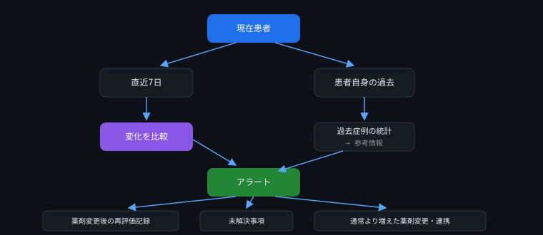

**「未来を予測する」機能ではありません。** 過去の統計から条件を
学習する仕組みはなく、条件は固定値または人が承認した変更のみ
です（`signal_policy` コマンド + 理由 + 操作記録が必須）。
「後続の記録が見つからない」はその通りに報告するだけで、
「対応がなかった」とは断定しません — 候補は必ず原記録での
確認を求める設計です。

### 出力イメージ


*Synthetic example — 架空データ。実患者データではない。*

### データが意味しないこと

- **MCS に記録がない ≠ 実際に行われていない**
- 投稿数が多い ≠ 患者が重症
- 薬剤名が記録された ≠ 現在服用中
- 薬剤変更後に改善した ≠ 変更が改善の原因
- 多職種が多い ≠ 良い/悪い連携
- warning なし ≠ 患者が安全

hermes-mcs は記録から確認できる事実・経過を構造化するシステムであり、
MCS 外の診療事実を自動補完しない。
