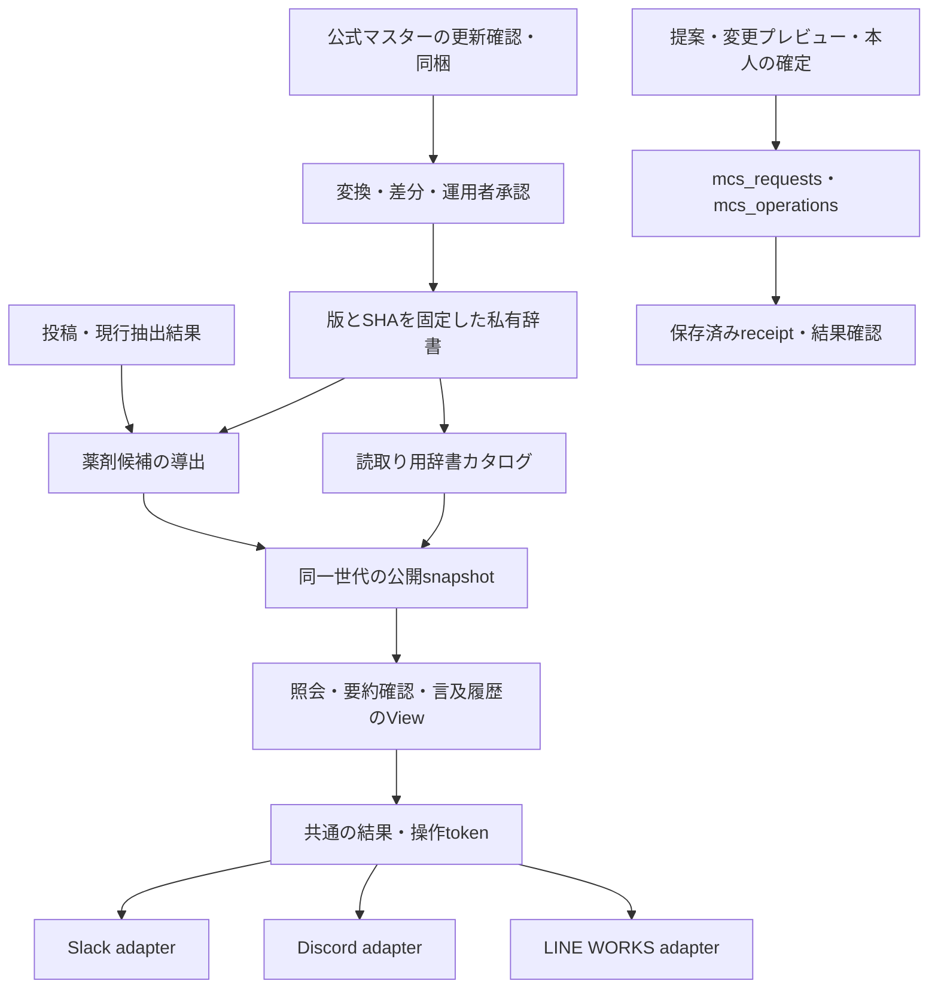

# 1.0.16 開発・実装・受入計画

2026-10-06。起点はv1.0.15（7ae6ee4）、専用branchは`develop/1.0.16`。
本番checkoutとは独立したworktreeで実装する。公開・配備・本番設定変更はこの作業に含めない。

| 依頼対象 | 実装・受入条件 | 現在の状態 |
|---|---|---|
| gateway再起動 | 所有serviceのuser/gui登録を識別し、非同期でsupervisor PID変更を検証。曖昧・失敗・結果不明は区別し、自己更新の行き詰まりを防ぐ | 実装・個別合成回帰済み。更新ランチャーとの同梱経路192件成功 |
| 添付の削除・復帰 | 削除失敗時のpathと再試行を保持し、配信保留中の添付を保護。欠落したwithdrawn添付はdownloadedへ誤復帰させない | 実装・core/ingest1787件成功 |
| 薬剤候補の導出 | keysetによる途中再開。辞書切替・無効化のDB記録後、または進捗破損時の旧候補を非表示。原文・派生世代の変更も再確認 | 実装・保存済みrollup/要約/exportの世代連携216件成功 |
| 監視警報の配送 | 検知と配送を分離。未送信確定だけ再試行、結果不明は同じ警報を自動再送せず、記録不能を成功にしない | 実装・個別合成回帰済み |
| 稼働版診断 | diskのrevision/変更状態とservice PID/起動時刻の証拠を分離。ロード済みrevisionは不明を明示し、時刻比較は推定として表示 | 実装・個別合成回帰済み |
| Keychain診断 | 非対話の読取拒否をロックまたは対話・アクセス制限として表現。自動解除・保護弱体化を行わない | 実装・個別合成回帰済み |
| マスター全件対応 | 実masterのRAM内集計に基づく20,000項目/8MiB上限。既存pin・私有ファイル・状態/日付・承認条件を維持 | 実装・19,272行の完全合成変換回帰済み |
| マスターの有用な利用 | CLIで一致候補照会、規格/剤形を確定しない参照検索、更新差分と別名衝突確認。製品/一般名処方/成分別の候補統計と未照合レビュー | 実装・CLI/ルーティング51件成功。辞書差分/検索/型別統計の合成検証済み |
| チャット・投稿要約の品質 | 共通表示へ辞書候補を添え、原文の薬剤名・用量・中止/予定・否定/他者/過去の抑制を保持。辞書変更時の表示cacheも確認 | 実装・共通投稿要約/テキスト通知/カード表示の関連281件成功（新規14件含む） |
| リリースへのマスター同梱 | 各リリース準備で公式更新を照合し、新版があれば出典・hash・加工/利用条件とともに同梱。設定の自動有効化や承認偽造はしない | 20260930原本・manifestを同梱。無通信の全19,272行検証と関連合成70件成功 |
| 文書の整合 | 古いロードマップを歴史記録として保持し、現実装と未確認を追記。利用手順と生成表を更新 | 更新・生成整合/static gates成功 |

既存モデル・取得間隔・既読化・人承認・C1契約は変更しない。
薬剤の表層名と薬剤行は維持し、一般名処方codeや薬価codeから成分・YJ・臨床的同等性を推定しない。
禁忌・相互作用判定、処方の自動変更、MCSへの新しい投稿/スタンプ送信は実装しない。

公式masterは公開元の20260930版ZIPをRAM内で集計し、19,272行から12,792候補identity、
出典metadataを除くcompact見積5,430,199 bytes・最大42aliasesを確認。
上記RAM調査では実master行をrepoへ保存していない。その後のオーナー指示により公開原本ZIPを配布資産として同梱した。実master行・実投稿をfixtureへ転載せず、利用条件の採用・承認者・本番辞書の有効化は未実施。
テストは既存隔離runner、一時DBと完全合成fixture・stubのみを使う。

必須lint/生成整合・bundle全行検証・static gates 10/10成功。追加表示の関連281件成功。

2026-10-06 Python 3.13.12 再検証: core/ingest 1787件成功。extract/views/notify/ops/meta/integration 4735件成功・2件skip。adapters/plugin/release 922件成功。semantic 967件成功（いずれも失敗0）。更新ランチャー同梱経路の対象5ファイルは318件成功（前記の192件記述は対象ファイル推定のずれ）。CPython 3.14 でのみ deep-JSON 拒否系55件が失敗する既知の環境差は §7.3 を参照。追加要件の表示・同梱は別途検証する。

オーナー指定により、このrepoの今後のリリースはrelease-mcs（リリースMCS）skillを使用する。一般repository-releaseをコピーし、毎回の公式master更新照合・新版の同梱/検証を必須にする。skill正本は~/.agents/skills/release-mcs/SKILL.md。

release-mcs正本作成済み。元repository-releaseの共通本文と参照2件を保持し、MCS更新照合工程と日本語UI名を追加。形式・参照・継承確認と8代表ケースのstatic/manual確認成功。次セッションのhost自動発見・実リリース起動は未検証。

チャット要約: 原文の薬剤行に未確認の辞書候補を併記し、否定・家族・過去の抑制を維持。辞書候補が消えた時だけ表示世代を変え、cursor進行・無変更の再導出・無効化後の後始末でカード操作を余分に失効させない。
既存Slack/LINE WORKS説明図は辞書候補を有効化していない例としてソースと整合し、SVG/PNGペア検証成功。実画面での新しい候補表示・実SDK接続は未検証。


## 1. 医薬品マスター機能拡張の範囲と状態

2026-10-06のユーザー指定と再レビューを反映する。SlackチャットUIの使いやすさを基準に、
**Slack・Discord・LINE WORKSの3通知先で同じ5機能・意味・権限・承認条件を提供する**。
本節以降は未実装の計画であり、冒頭の既存実装・合成検証の成功とは区別する。
全5機能を1.0.16の対象として追跡し、内部工程を分けても自動的に別版へ繰り延べない。
この計画の記録は追加機能の実装開始・commit・公開・本番適用の完了を意味しない。

| ID | 成果物 | 現状と追加範囲 | 最低受入条件 |
|---|---|---|---|
| DM-0 | 共通の読取り用辞書カタログ | 私有辞書を直接読むCLIは存在。チャット用snapshot内カタログを追加 | 承認済みの有効な辞書だけ公開。候補注釈と版・SHA・resolver世代が一致。無効化・破損・未公開・未導出を区別 |
| DM-1 | 投稿要約の薬剤確認 | 候補併記は実装済み。原文・抽出薬名・候補・確認理由の比較操作を追加 | 未照合を誤薬と断定しない。原文・用量・開始/中止・否定・家族・過去・予定を保持。報告対象が表示世代と一致 |
| DM-2 | チャットからの薬剤照会・検索 | lookup/search CLIを再利用し、3通知先の入力・候補選択へ接続 | JSON入力不要。候補総数・曖昧さ・規格/剤形・出典を保持。選択は詳細閲覧で、処方確定ではない |
| DM-3 | 患者別の薬剤言及履歴 | rollupの最新状態表示を入口に利用し、投稿からの履歴読取りを追加 | 投稿日時と出来事の日付、予定と実施、薬剤規格・剤形を区別。原文へ戻れる。未取得/未抽出を「言及なし」にしない |
| DM-4 | マスター更新の影響確認 | 辞書diffは実装済み。更新前後で同じ言及を再照合する読取り専用レポートを追加 | 未照合→候補あり、単一→複数、削除、ID変更を表示。比較でDB・辞書・設定を変更しない |
| DM-5 | 別名提案・承認・切替 | 未照合レビュー一覧は実装済み。提案と管理者による辞書変更を追加 | 追加後の衝突・影響をプレビュー。変更前後SHA・対象ID・理由・本人確認・receiptを保持。二重実行と古い承認を拒否し、復旧できる |

一般名処方・製品・成分は区別し、同一成分・臨床的同等性・正しい処方を推定しない。
禁忌/相互作用判定、自動処方変更、MCSへの新規投稿/スタンプ送信、モデル変更は含めない。
第1段階の要約確認は構造化薬剤欄を対象とする。自由文summary全体の薬剤誤りを
網羅的に検出できるとは扱わない。原文の要約項目を表示都合で切り捨てない。

## 2. レビュー結果と設計上の前提

| 確認した実装 | 設計への反映 |
|---|---|
| [mcs_drug](../../../mcs/ops/mcs_drug.py)は私有path/SHAを検証してlookup/search/compareを実行 | チャットからCLIや任意pathを呼び出さず、snapshot読取りへ接続する |
| [drug_map.current_refs](../../../mcs/extract/drug_map.py)は現行source/辞書世代へ束縛したDB注釈を返す | DM-1/3はこの検証を共有し、読取り側で私有辞書を読み直さない |
| [run_check](../../../mcs/ingest/run_check.py)の導出後にrollupを更新する | 新カタログ公開と世代確定をこの書込み側へ配置する |
| [ledger.publish_snapshot](../../../mcs/core/ledger.py)はbackup・検証・atomic renameで公開する | カタログと候補を同じsnapshotへ入れ、辞書用の独立公開ファイル/DBを増やさない |
| [semantic_projection](../../../mcs/semantic/semantic_projection.py)には文章中の語から薬名を簡易抽出する処理がある | 未照合の原因を辞書不足と決め付けず、抽出名と根拠を比較する。別名を自動追加しない |
| [mcs_operations](../../../mcs/ops/mcs_operations.py)のextract_feedbackはextract_llmを対象にする | 他のsource_kindへ報告するときは、対象artifactと再処理先を明示的に対応させる。旧報告を無条件に別世代へ適用しない |
| [rollup](../../../mcs/extract/rollup.py)は表層名ごとの最新状態をまとめる | DM-3の全履歴をrollupだけから復元せず、現行投稿・抽出結果を読む |
| 共通[spec](../../../adapters/common/spec.py)はDiscord由来の文字数・部品数予算を持つ | Slackの上限に合わせて共通契約を一律に緩めず、adapterごとに表示量を調整する |
| [LINE WORKS actions](../../../adapters/lineworks/actions.py)はDM入力・番号選択・actor別sessionを持つ | 入力中の患者切替・取消・期限切れを扱い、古い入力を新しい対象へ適用しない |

## 3. 共通のデータとシステム内の配線



### 3.1 書込み・公開

- `run_check.stage_derive`と`drug_map`を再利用する。カタログは既存artifactsの専用kindに
  現行1世代として保持し、辞書切替/無効化の進捗記録と整合した短いtransactionで更新する。
  kind/schemaの名称は実装前に確定し、既存の`med_ref_progress`契約を付随作業で変更しない。
- 対象は有効・承認済み・pin検証済みの辞書。原本同梱だけでは公開・有効化しない。
  初期化失敗・無効化・未知形式の場合は照会不能を明示し、古いカタログを現行として提供しない。
- カタログは辞書ID/SHA/resolver・種別・候補ID・表示名・別名・出典を保持する。
  UIへ私有pathや承認者名を出力せず、承認を代替する架空の値を作らない。
- 全件カタログによるDB/snapshot容量・公開時間・照会時間を計測する。20,000項目/8MiB等の
  既存上限を保持し、黙って部分公開しない。毎tickカタログを履歴として蓄積しない。
- snapshotの内容はsnapshot時点の状態。実運用での切替は新snapshot公開後に反映する。

### 3.2 読取り・チャット入口

- [mcs_view.View](../../../mcs/views/mcs_view.py)へDM-1/2/3の読取りを追加し、
  [hermes_plugin共通dispatch](../../../hermes_plugin/__init__.py)と
  [native commands](../../../adapters/common/commands.py)から利用する。
- 患者別レビュー/履歴はproject_id・投稿ID・患者範囲を検証する。患者を指定しない辞書照会は
  専用のsystem読取り経路とし、既存の患者範囲確認を広く免除しない。
  LINE WORKSのprojectless token検証も、この読取り種別だけ明示的に対応させる。
- 引数・kindのallowlist、上限、cursor、結果の大きさ、未知field拒否を入口とViewで整合する。
  新操作のfieldを既存全操作へ無条件に許可しない。
- 候補照合は`DrugMap.lookup/search`の規則を共有する。snapshot内カタログのschema/hash/世代を
  検証する入口を用意し、私有ファイルloaderの所有者・権限・SHA検証を弱めない。
- 人向けの`/mcs 薬 名前`等は実装予定の入力形式。現行`/mcs`はJSON解析を行うため、
  限定した文字列解析の追加が必要。Discord/LINE WORKSにも等価の入口を用意し、
  現行JSON操作の互換性とHermes/standaloneの既存接続経路を保持する。

### 3.3 共通結果・表示世代

結果は照合状態、候補種別/ID/表示名、原文薬名・用量・根拠、出典・辞書世代、
総件数・ページ情報・可能な操作を構造化して返す。Block KitやDiscord部品をcoreへ持ち込まない。

操作tokenとcursorは操作者、transport/所属先/profile/route_epoch、患者/投稿、
source artifact/hash、辞書世代、query/表示対象へ束縛する。任意IDへの差替えを拒否する。
表示を更新するときは既存の`fact_generations`・`source_fp`等を再利用し、辞書候補の変化を検出する。
cursor進行や同一結果の再導出だけでカード操作を失効させない。
新actionはrunner、共通spec/envelopes、各adapterのallowlistへ一緒に配線する。
旧workerで未知の操作を黙って無視・配送成功と扱わず、既存の互換性ゲートを保持する。

## 4. 3通知先のUI契約

| 操作 | Slack | Discord | LINE WORKS |
|---|---|---|---|
| カード入口 | 「操作を選ぶ…」→薬剤を確認 | 「他の操作…」→薬剤を確認 | 「その他の操作」→本人DMの薬剤確認 |
| 薬名の入力 | 入力モーダル | 入力モーダル | DMで薬名を入力 |
| 候補の選択 | 選択メニュー | 選択メニュー/ボタン | 番号選択/postbackボタン |
| 詳細・履歴 | 結果モーダルの更新 | 本人向け応答の更新 | DMでページごとに表示 |
| 提案・承認 | 内容確認→確定/取消 | 内容確認→確定/取消 | DMで内容確認→確定/取消 |

主ボタンは既存の確認・担当・タスク作成を維持し、薬剤機能は二次メニューへ集約する。
薬剤名・用量・開始/中止・予定を保持し、新しい照合状態は短い表示にする。
辞書ID/SHA・詳細出典は確認画面へまとめる。未照合だけで強い警告・緊急通知を出さない。
モバイルでは薬剤ごとの縦並びを使い、横長比較表・生JSON・全マスターの長大な選択肢を表示しない。

### 4.1 日常の操作

1. 投稿カードの「薬剤を確認」を開く。
2. 当該投稿の薬剤を選び、原文/抽出名/候補/確認理由を見る。
3. 「候補を見る」「候補を検索」「元の投稿を見る」「誤りを報告」へ進む。
4. 患者まとめから開いた場合は「言及履歴」を選べる。投稿単位と患者全体の範囲を明示する。

候補選択は詳細閲覧・履歴の絞込みに使う。処方確定や全体辞書変更へ自動接続しない。
言及履歴は投稿日時・明示された出来事の日付・薬名・記載用量・行為・予定/不明等の区分と
原文への導線を表示する。家族/他者の薬を本人履歴へ混ぜず、過去の記載は過去として区別する。
同じ候補IDでも規格・剤形・用量の原文を保持し、名称だけで薬剤行や状態を統合しない。

### 4.2 表示量・応答・入力session

- 最大5件/ページを基本とし、各transportの実際の文字数/部品数予算で件数を減らす。
  総件数・ページ位置を表示し、長い名称・規格・剤形の識別情報を黙って落とさない。
  1件が長い場合も詳細を分割して全情報へ到達できるようにする。
- Slackは即時ackと期限内のモーダル表示を先に行い、既存workerの結果で更新する。
  結果表示モーダル、view ID/hashを使った更新競合処理、閉じた後の結果扱いを追加する。
- Discordはモーダルを開く操作で先にdeferしない。その他の操作/入力送信は適切な初期応答と
  本人向けfollowupへ分ける。期限切れ後は保存結果を再照会する入口を提供する。
- LINE WORKSは既存DM入力・番号選択を再利用する。同じ操作者が別患者を開いたときは
  sessionの切替/取消を明示し、以前の入力を新対象へ転用しない。
- Slack/Discordの本人向け応答とLINE WORKSのDMは保持の性質が異なる。
  承認の成否をチャット画面だけへ保存せず、DB/receiptから再確認できるようにする。
  読取り結果や患者情報を共有チャンネルへ自動で追加投稿しない。
- 既存の共通spec・registry・envelopes・workerを拡張し、新しい汎用UI基盤や常駐サービスは作らない。

仕様確認の一次資料:
[Slack応答](https://docs.slack.dev/tools/bolt-python/concepts/acknowledge/)、
[Slackモーダル](https://docs.slack.dev/surfaces/modals/)、
[Slack Block Kit](https://docs.slack.dev/block-kit/)、
[Slack ephemeral](https://docs.slack.dev/reference/methods/chat.postEphemeral/)、
[Discord interactions](https://docs.discord.com/developers/interactions/receiving-and-responding)、
[LINE WORKSユーザー宛メッセージ](https://developers.worksmobile.com/jp/docs/bot-user-message-send)。
Slack/Discordの初期応答やモーダル用triggerには約3秒の期限がある。実装時に現在の公式仕様と
固定SDKの対応を再照合し、APIの一般仕様を既存adapterが実装済みである証拠にしない。

## 5. 更新の影響確認・別名変更の承認

### 5.1 DM-4 更新影響レポート

まずローカルCLIの読取り専用レポートを作る。更新前後の辞書で同じsnapshotの薬剤名を照合し、
未照合→候補あり、単一→複数、候補削除、候補ID変更等を数える。
両辞書SHA・snapshot世代・対象範囲・未評価件数を記録する。件数を診療上の問題件数と扱わない。
その共通処理を3通知先の管理者向け確認に接続し、患者詳細は患者範囲の権限内だけ表示する。
[release-mcs手順](../RELEASE_NOTES.md)へ公開masterの形式/hash検証を接続する。
運用環境の患者別影響や原文をリリース文書・配布資産・外部サービスへ含めない。

### 5.2 DM-5 別名提案・承認・切替・復旧

未照合レビューからの提案と、全患者の辞書変更を別操作にする。公式原本は保持し、
追加別名の出所・提案・承認・変更履歴を区別する。実投稿を別名fixtureへ転載しない。

1. 対象候補IDと別名を提案し、追加後の候補・衝突・既存言及への影響をプレビューする。
2. 管理者が変更前後SHA・対象ID・理由を確認し、本人の確定操作を行う。
3. `mcs_requests`の専用操作として検証・enqueueし、`mcs_operations`のreceipt経路で適用する。
4. 新規私有辞書・切替設定・復旧用の前版を扱い、ファイル更新とDB記録の部分失敗/再実行を検証する。
5. 既存の導出経路で候補・rollup・snapshotを更新し、3通知先から保存結果を確認できるようにする。

薬剤辞書を管理できる操作者の範囲を実装前に確定する。患者閲覧や提案ができることから
全体辞書の承認権限を推定しない。専用管理者allowlistが必要な場合は最小範囲で設定を追加する。
`--confirm-human`・reason・receipt、変更前SHAの再確認、二重確定防止を維持する。
処理結果が不明なら現在の辞書/設定とreceiptを確認してから再試行する。
変更後の候補再導出にLLMの全件再抽出を自動で伴わせない。

## 6. 内部工程・配線箇所・所有範囲

以下は全て未着手。受入前に実装済みへ変更しない。

| 工程 | 対象 | 主な配線先/成果物 | 依存と受入 |
|---|---|---|---|
| P0 | DM-0、入力/権限/結果契約の確定 | drug_map、run_check、artifacts/snapshot、Viewの読取り契約 | カタログ公開条件・管理者範囲・source別誤り報告先を確定。容量/公開/照会を計測 |
| P1 | DM-1/2の共通読取り | mcs_view、drug_map、現行抽出結果の比較 | P0。旧snapshot・未導出・破損を明示。私有ファイルアクセス/DB書込みなし |
| P2-S | Slack入口・入力・結果 | slack/actions/cards、共通text/registry/envelopes、notify_cards/notify_cmds | P1。モバイル・応答期限・view更新・取消・ページングを検証 |
| P2-D | Discord入口・入力・結果 | discord/actions/cards、共通操作/結果 | P1。モーダル初期応答・ephemeral結果・期限切れを検証 |
| P2-L | LINE WORKS入口・入力・結果 | lineworks/actions/cards、共通操作/結果 | P1。DM入力・番号/postback・session切替・取消を検証 |
| P3 | DM-3 | 患者別読取りビュー、患者まとめ、各adapterの履歴表示 | P1/2。投稿/出来事日付・予定/実施・原文・部分取得・ページングを検証 |
| P4 | DM-4 | mcs_drug、差分/影響処理、3通知先の管理画面、release-mcs手順 | P0。比較の無変更・件数と未評価・患者範囲を検証 |
| P5 | DM-5 | mcs_requests、mcs_operations、私有辞書/設定切替、各adapterの確認UI | P4。人承認・古いプレビュー・二重実行・部分失敗・復旧を検証 |
| P6 | 全件統合・文書・導入更新 | changes、USER_GUIDE、画面例、生成器、CI、受入記録 | 全5機能を3通知先で受入。SDK/実画面/本番適用を合成テストと区別 |

カタログ書込み、要約確認/履歴の読取り、更新影響CLIは依存を確認して独立開発できる。
P2-S/D/Lのadapter固有部分は並行開発し、共通dispatch/View/spec/text/registry/envelopes、
公開スキーマ、設定・承認経路の編集所有者は一人に固定して順に統合する。
各担当の完了ごとに差分と受入を確認し、新しい前提変更だけを計画へ反映する。

## 7. 受入・検証・公開条件

### 7.1 共通の合成回帰

- 正常一致、製品/一般名処方/成分、複数候補、総称、未照合、未承認、未設定、無効化、破損、未導出。
- 原文・artifact/hash・辞書世代の変更、旧snapshot、切替途中、削除投稿、返信、部分取得/未抽出。
- 複数薬剤を含む根拠、規格/剤形/用量違い、否定、家族/他者、過去、予定、開始/変更/中止、不明時刻。
- 表示したsource_kind/artifactへ紐付く誤り報告と、対応する再処理先。古い報告を別世代へ転用しない。
- 管理者/一般利用者/権限外患者、transport・所属先・profile・route_epoch・本人の差替え。
- 別名衝突、辞書変更前後SHA不一致、古いプレビュー、連打、二重確定、保存の部分失敗、復旧、再起動後のreceipt照会。
- 読取りによるDB/辞書/config変更なし、C1出力・既読化・既存人承認契約の回帰。

### 7.2 3通知先の等価性・UI

同じ完全合成ケースをSlack/Discord/LINE WORKSへ流し、候補・曖昧さ・原文・権限判断・
承認結果が一致することを確認する。画面配置や入力方式の一致は要求しない。
スマートフォン幅、長い薬名、候補多数、文字数/部品上限、ページ往復、色だけに依存しない表示、
入力遅延、処理中、画面を閉じる、取消、応答/session/token期限切れ、複数利用者、患者切替を検証する。
チャット配送の成功と業務処理の確定を区別し、結果不明の自動再送を増やさない。

### 7.3 必須チェックと完了記録

既存の隔離runner・一時DB・stub・完全合成fixtureのみを用い、実MCS/通知先/Keychain/LLM/Jevへ
テストからアクセスしない。coreの依存はstdlibのみ、flat importを維持する。
変更影響に必要な既存テストから検証し、無変更の成功結果は再利用する。
各runtime変更に日本語changesを作成し、生成文書・画面例は正本から更新する。

```sh
MCS_TEST_PYTHON=/path/to/test/python scripts/run_tests.sh tests/<対象領域>/  # tests/semantic/ を含む
python3 scripts/development/update_readme.py
make check gates
python3 scripts/development/release_notes.py check
python3 scripts/development/generate_slack_gallery.py --check
python3 scripts/development/generate_lineworks_gallery.py --check
```

検証は CI と同じ Python 3.13（または Hermes venv の 3.11）で行う。CPython 3.14 では
deep-JSON 拒否系の55件が起点 v1.0.15（7ae6ee4）でも同じく失敗する環境差があり、
この worktree の変更による退行ではない（2026-10-06 確認）。

実SDKとの互換性は既存のpinned CI laneで別に検証する。Hermes/standalone・3通知先の
対応する導入/過去版更新、gateway/独立adapterへの反映条件を追跡する。
実画面検証は適切な環境と操作権限がある場合に行い、合成描画やpayload検証と区別する。
リリースには`release-mcs`を使い、毎回公式master更新を確認し、更新があれば同じ版に同梱する。
未対応版/layout・確認不能を更新なしと扱わない。公開・配備・辞書有効化は既存の明示範囲に従う。

- [ ] DM-0のカタログ公開・容量・世代検証
- [ ] DM-1の要約確認とsource別誤り報告
- [ ] DM-2の3通知先の照会・検索・候補選択
- [ ] DM-3の患者別言及履歴・原文への導線
- [ ] DM-4の読取り専用影響レポートと3通知先の管理者表示
- [ ] DM-5の提案・承認・適用・復旧・receipt照会
- [ ] 3通知先の共通ケース、mobile、期限・session・ページング受入
- [ ] 文書/画面例/changes/必須ゲート・pinned SDK・導入更新の検証記録

本計画記録時点で、追加5機能の実画面・実SDK接続・本番適用は未実施。

## 8. 2026-10-06 追記: レビュー後の追加3件

オーナー決定済みの3件を実装した。変更記録は
`changes/urgency-rule-precision-llm-priority-1.0.16.json` と
`changes/card-heading-honorific-and-urgency-icon-1.0.16.json`。

1. **カード見出しの「様」削除** — `notify_render.patient_heading()` は敬称を
   付与せず `患者名（施設）` で始める。保存済み patient_name は加工しない。
   変更ファイル: `mcs/notify/notify_render.py`、画面例生成器
   `scripts/development/generate_slack_gallery.py` /
   `generate_lineworks_gallery.py`、手書き `docs/screenshots/*.svg`、
   見出し書式を説明する `docs/guides/USER_GUIDE.md`。
2. **機械照合の緊急表示を 🚨 に** — `structured_view.URGENCY_LABEL["rule"]` と
   `notify_render.URGENCY_TAG["rule"]` を `🚨` に変更。`llm` 側
   （`緊急度: 高（AI抽出）` / `［緊急度高・AI判定］`）は変更しない。
3. **緊急判定の精度** — (a) `mcs/extract/v1/extract.py` のルール照合を
   絞り込み（`緊急時/緊急連絡先` 等の複合語、場合/際/なら等の条件節・
   仮定、`搬送先` 等、動作を伴わない単独「すぐに」を除外。
   RULE_VERSION 9→10 で全投稿を再抽出）。(b) `message_urgency()` を
   LLM 判定優先に変更 — 現行 fact artifact（v4/canonical 行は urgency を
   持たないため、裏の hash 一致 extract_llm 行を参照）が `routine` なら
   `None`（機械照合の緊急表示・シグナル即時化を出さない）、`high` なら
   `llm`、LLM 判定が無いときだけ `rule`。

受入条件: 追加・更新した合成テスト（`test_extraction_review.py` の
urgency パラメータ26件追加と `message_urgency` 契約6件）、画面例の
SVG/PNG 再生成、両 gallery `--check`、既存 urgency 関連テストの
新契約への整合。状態: 実装済み。Python 3.13.12 での合成テスト全成功は
§7.3 直前の再検証記録を参照。画面例 SVG は再生成済みだが、PNG 再生成に
必要な Inkscape がこの環境に無く `--check` が PNG ペアで失敗する —
PNG 更新は Inkscape のある環境での `--png` 実行を要する（未検証）。

## 9. 2026-10-07 追記: LLM 緊急度契約の世代更新（extract v5）

深掘りレビューした7案をオーナー指示により全て 1.0.16 に収めた。変更記録は
`changes/extract-v5-urgency-evidence-unclear-1.0.16.json`。

1. **urgency_evidence（案1）** — `urgency: high` に本文からの完全一致引用
   （最大2件）を必須化。`locate_quote_span` で一意定位できない引用は捨て、
   引用が残らない `high` は **`unclear` へ降格**（`routine` へのサイレントな
   下方修正はしない）。`routine` には根拠を要求しない。カードの緊急度行は
   `— 根拠:「…」` を併記する（`structured_view.structured_lines`）。
2. **few-shot（案2）** — 合成例を2件追加: 意識反応低下＋至急依頼の高緊急
   正例（urgency_evidence 付き）、緊急連絡先カード更新＋条件節の陰性例。
   実投稿は含めない。プロンプト変更により飛行中のチャンク checkpoint は
   再生成される（完了済み artifact は無傷）。
3. **評価拡充（案3）** — `evaluation/extract_cases.json` を46→60件。
   高緊急正例・条件節/過去形/家族の事象・判断保留・9,606字のチャンク分割
   ケースを追加し、偽陽性ケースに `forbid.urgency: high` を設定。
   ベンチの raw 出力に `urgency_evidence` を追加。合成ケースのみであり、
   実測の臨床精度を主張するものではない。
4. **チャンク統合（案4）** — `_merge` の urgency 規則を
   `接地した high > unclear > routine` に変更し、urgency_evidence を統合後も
   保持。`_improves` の high ラチェットは in-call 補完パスの防御として維持
   （下方修正は QC フィードバック再抽出の仕事という既存の分業を継続）。
5. **Jev/QC の運用化（案5）** — `structured_view.urgency_qc_disagreement()`
   が現行 extract_llm artifact にピンされた最新 QC の不一致を返す。
   不一致はカード/通知プレビュー/シグナル文/日次ダイジェストに
   `（監査では通常判定）` / `（監査では判断保留）` と表示し、
   `notify_urgent._eligible` は不一致の間 `qc_overridden` で再確認通知を
   抑止する。QC 行が無い・古い artifact への監査は何も変えない
   （fail-open）。既存の「不一致 → 注記付き1回再抽出」経路は維持。
6. **バイタル閾値（案6）** — `cfg["vital_urgency"]`（既定 off）。
   `flag` は閾値超過を `vital_flags` に記録しカードに
   `閾値超過の測定値: …` 行を出すのみ、`high` は緊急度を高にして閾値根拠を
   `urgency_evidence` にする。既定閾値 SpO2≤90 / SBP≤90 / SBP≥180 / BS≤70
   （config 上書き可）。検証後・チャンク統合後に `_apply_vital_policy` で
   適用するため単一・チャンク・バッチで一致する。バイタル欄が
   subject/時制を持たない制約は、数値周辺±40字の文脈スキャン
   （家族・条件節・過去形・測定不能の語）でヒューリスティックに除外 —
   完全ではない旨を INSTALLATION.md に明記。有効化・閾値は臨床責任者の
   承認が前提で、コードが既定で有効化することはない。
7. **unclear（案7）** — スキーマ enum・validator・merge・semantic_qc の
   監査対象に追加。`message_urgency()` は `unclear` を「判定なし」と
   区別せず棄権として扱い、機械照合の網（`rule` → 🚨）へフォール
   スルーさせる — routine のようなクリアランスではないため。
   AI高バッジ・再確認通知の対象にはならない。

`EXTRACT_VERSION` を 4→5 に変更（schema 変更のため全投稿が新契約で
再抽出される）。`run_check.stage_derive`・`extract_llm --all`（resident
ループは config 再読込に追従）・単発 `--limit` 経路の3入口から
`vital_threshold_policy(cfg)` を配線。

受入状態: 合成テストは全領域で成功（extract 802 / notify+views+
semantic+ingest 3,546 を Python 3.13.12・隔離 runner で再確認、ruff 全範囲
パス）。追加した回帰: validator の unclear 受理・根拠無し high の降格・
merge 優先度・閾値ポリシーの off/flag/high・文脈除外・チャンク統合後適用、
`message_urgency` の unclear→rule フォールスルー、QC 不一致の表示注記と
昇格抑止（agree/stale-pin は抑止しない）、semantic_qc の unclear 監査対象化。

未検証（実装≠受入）: 実ローカルLLMでの `extract_bench` 実走・新契約の
実測精度、QC 不一致の実機での発生挙動、`vital_urgency` を実 config で
有効化した運用。実患者データによる検証・G6 の人的評価・運用証跡は
この作業では得られておらず、公開判定は別ゲートのまま。

## 10. 2026-10-07 追記: 監査反映と DM-1/2/4・緊急度の誤り報告

オーナー指示により以下を 1.0.16 に追加した。§1 の DM 表と §7.3 のチェックリストは
計画時点の記録として残し、状態はこの節を正とする。

| 対象 | 実装 | 受入状態 |
|---|---|---|
| ⚠ 誤り報告「緊急度」 | `EXTRACT_FEEDBACK_FIELDS` と共通ラベルに `urgency`/緊急度 を追加し、値の一致をテストで固定。`data_quality.urgency_rule_outcomes.human_urgency_reports` で件数を集計 | 合成回帰成功。⚠ は AI 抽出のある投稿だけに出るため、機械照合だけの 🚨 は報告対象外 |
| DM-1 薬剤を確認 | カードの二次メニューに「薬剤を確認」。対象はシグナルの根拠投稿、またはスレッド内で薬剤のある最新投稿（新しい順20件まで）。カードの薬剤行と同じ選択（`structured_view._med_entries` に共通化）に、現行の辞書注釈を縦並びで表示 | runner・3通知先の合成回帰成功。実画面は未確認 |
| DM-2 薬剤を検索 | 「薬剤を検索」→入力画面→辞書の名称・別名・コードの部分一致を10件。`drug_map.active_dictionary` が config 固定かつ DB の現行導出世代と一致する承認済み辞書だけを返す | 同上。辞書未有効・切替中はボタンを出さず、直接の操作にも候補を返さない |
| DM-4 影響レポート | `mcs drug impact` が公開 snapshot の薬剤言及を新旧辞書で再照合し、変化を件数と薬名単位で集計（ID・本文なし） | 合成回帰成功。実 snapshot・実辞書では未実行 |
| DM-0 | 実装しない。カードは公開 snapshot の View ではなく runner の既存 view で表示されるため、snapshot 内カタログの代わりに現行導出世代との一致確認で整合を保つ（§3.1・§3.2 の前提変更） | Hermes read kind・View から辞書照会を出す要件が生じたら再検討 |
| 整理 | 辞書 config の検証・読込みを `drug_map.config_error`/`configured` に集約（run_check・mcs_setup・mcs_drug・カード検索が共有）。入力画面の送信分岐を `text.VIEW_FORMS`/`QUERY_FORMS` に集約。LINE WORKS で空の検索語が無応答で捨てられていた問題を案内表示に修正 | 既存回帰を含め成功 |
| 監査反映 | 再起動子プロセスの `-I`・`cwd="/"`、復旧ツール読込み失敗時も更新を止めない、結果不明記録の上限50件、保存先外の添付 path の1回報告、抑止件数の統計 | 合成回帰成功。実機未適用 |

DM-3（患者別言及履歴）と DM-5（別名の提案・承認・切替）は未着手のまま。
